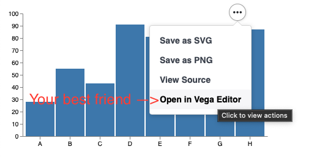

# Cookbook
The library exposes the [vega examples](https://vega.github.io/vega/examples/) and [vega lite examples](https://vega.github.io/vega-lite/examples/) convieniently as case classes. The class names correspond to the title of the charts (with some special characters removed).

## Suggested Workflow
1. Identify a plot which looks similar to your desired visualisation
2. Customise it, by modifiying the JSON spec to be your desired visualisation

As always... lean into vega;



## Some Concepts
Each "plot" is a case class which accepts a list of "modifiers". Each case class has the signature accepting a single argument of type; 

```scala
Seq[ujson.Value => Unit] 
```
i.e. a list of functions which modifiy a ```ujson.Value```
This signature appears often enough that it is aliased as;

```scala
type JsonMod = Seq[ujson.Value => Unit]
```

Upon creation, each of these functions is applied to a "base spec". To start with, a base spec will be an example from the vega website). The signature of ```viz.vega.plots.SimpleBarChart()``` is
```scala 
case class BarChart(override val mods : JsonMod=List())(using PlotTarget) extends FromUrl(SpecUrl.BarChart)
```
The constiuents of this definition are;
- mods change the spec (to make it look the way you want - for example adding your own data)
- PlotTarget is a side effect which is run when the case class is created. Often will display the plot in a browser.
- The final part tells this case class, where to obtain a "base specification". In this case, https://vega.github.io/vega/examples/bar-chart.vg.json

What that means, is that to add a title, we need to [read the vega docs](https://vega.github.io/vega/docs/title/). To skip some steps, try...

```scala
SimpleBarChartLite(List(spec => spec("title") = "Got Viz?"))
```

We'll revisit this in more detail below. Crucially, to know _where_ to add stuff to the spec, you're going to need the vega documentation. 

[Vega documentation](https://vega.github.io/vega/docs/)

[Vega Lite documentation](https://vega.github.io/vega-lite/docs/)

Finally, a small number of "helpers" appear often enough that they are honoured with an implementation in the library; 

```scala
SunburstDrag(List(viz.Utils.fillDiv, viz.Utils.fixDefaultDataUrl))
```

## Levels of abstraction
You need a [plot target](plotTargets.md) in place, and then we're ready to plot some data. The idea of the library is to wrap vega by simply treating a chart spec as a JSON object.  

We can easily manipulate JSON objects using [ujson](https://www.lihaoyi.com/post/uJsonfastflexibleandintuitiveJSONforScala.html). 

I work with this library in 4 ways
1. Pipe "raw" data into a vega example
1. Record a list of modifiers which were useful modifications to an example
1. Spec has been modified enough that a list of modifiers is confusing. Extend the WithBaseSpec class directly via a file or resource (see "Custom.scala"). Then pipe data into it.
1. In prod... don't use this library anymore - probably you have a webserver which means you already have javascript. Use vega directly, Keep the spec under version control and use vega data loading capabilities to talk to the API providing data. 


## "Raw" Data

The idea here, is that "raw datatypes" have some unambiguous visualisation which is relatively common to want to plot. Pie charts, bar charts and the like, which are always going to look very similar to the examples on the vega website, and come from a simple datastructure. We want to be able to plot these as quickly as possible. 

```scala
import viz.PlotTargets.desktopBrowser
import viz.extensions.*
```


### Labelled bar chart
```scala
List(("A", 4),("B", 6),("C", -1)).plotBarChart(List())
```
<div id="mdoc-html-run0" data-mdoc-js></div>

### Bar chart
```scala
val secondChart = (1 to 5).plotBarChart()
```
<div id="mdoc-html-run1" data-mdoc-js></div>

### Word cloud
```scala
List(
   "how much wood would a wood chuck chuck if a wood chuck could chuck wood", 
   "a wood chuck would chuck as much wood as a wood chuck could chuck if a wood chuck could chuck wood"
).plotWordcloud()
```
<div id="mdoc-html-run2" data-mdoc-js></div>


### Line Chart
```scala
List(1,5,3,15,7,8).plotLineChart()
```
<div id="mdoc-html-run3" data-mdoc-js></div>
### Dot Plot
```scala
List(1,11,1,2,3,4,4,4,4,4,5,6,8,8,9,8).plotDotPlot()
```
<div id="mdoc-html-run4" data-mdoc-js></div>
### Scatter Plot
```scala
List((1.0,2.0),(3.0,4.0),(0.5 , 5.0),(3.14159, 1.0)).plotScatter()
```
<div id="mdoc-html-run5" data-mdoc-js></div>
### Regression
```scala
List((1.0,2.0),(3.0,4.0),(0.5 , 5.0),(3.14159, 1.0)).plotRegression()
```
<div id="mdoc-html-run6" data-mdoc-js></div>

## "Spec Customisation"
Is one level of abstraction deeper. 

The core promise of the library, is that it wraps Vega. It goes one further step, by making the "examples" on the vega website, easy to plot, and then customise.

```scala
viz.vega.plots.LineChartLite(
    List(
        viz.Utils.fixDefaultDataUrl
    )
)
// res7: LineChartLite = LineChartLite(mods = List(Fix default data url))
```
<div id="mdoc-html-run7" data-mdoc-js></div>
As we've changed the home of the chart (which no longer is on the vega lite examples homepage), we also need to adapt it's data url to point to the right place, else data loading will fail. It's not a bad excercise to allow that failure. 


This is our hint on how we're going to manage minor modifications to plots. 

Here, we have the line chart example from vega lite. ```viz.vega.plots.xxx``` contains _all_ the examples on the vega, and vega-lite websites. vega-lite charts have "lite" appended.

Someone was apparently crazy enough to implement pacman in vega. As "proof" that we really did _all_ the examples, and for your gaming pleasure.

```scala
viz.vega.plots.Pacman()
// res9: Pacman = Pacman(mods = List())
```


<div id="viz_RHpXX0zd" class="viz"></div>

<script type="text/javascript">
const specRHpXX0zd = {
  "$schema": "https://vega.github.io/schema/vega/v5.json",
  "description": "An implementation of the classic video game Pacman.",
  "width": 600,
  "height": 600,
  "signals": [
    {
      "name": "grid",
      "value": {
        "width": 15,
        "height": 15
      }
    },
    {
      "name": "rangeWidthDelta",
      "update": "(width - blockSize*grid.width)/2"
    },
    {
      "name": "rangeHeightDelta",
      "update": "(height - blockSize*grid.height)/2"
    },
    {
      "name": "blockSize",
      "init": "min(width/grid.width, height/grid.height)"
    },
    {
      "name": "pacManIsOpen",
      "init": "true",
      "on": [
        {
          "events": {
            "type": "timer",
            "throttle": 500
          },
          "update": "!pacManIsOpen"
        }
      ]
    },
    {
      "name": "superPower",
      "init": "0",
      "on": [
        {
          "events": {
            "signal": "pacManX || pacManY"
          },
          "force": true,
          "update": "superPower > 0 ? superPower - 1 : 0"
        },
        {
          "events": {
            "signal": "testPowerEaten"
          },
          "update": "testPowerEaten? 30 : superPower"
        }
      ]
    },
    {
      "name": "restart",
      "on": [
        {
          "events": "timer:500",
          "update": "!superPower && ((gRedX === pacManX && gRedY === pacManY) || (gBlueX === pacManX && gBlueY === pacManY) || (gGreenX === pacManX && gGreenY === pacManY) || (gOrangeX === pacManX && gOrangeY === pacManY))"
        }
      ]
    },
    {
      "name": "testEatenGhost",
      "update": "superPower ? ((gRedX === pacManX && gRedY === pacManY) ? gRed : (gBlueX === pacManX && gBlueY === pacManY) ? gBlue : (gGreenX === pacManX && gGreenY === pacManY) ? gGreen : (gOrangeX === pacManX && gOrangeY === pacManY) ? gOrange : null) : null"
    },
    {
      "name": "testEaten",
      "update": "!restart && (indata('gums', 'key', pacManX+'-'+pacManY) && !indata('eatenGums', 'key', pacManX+'-'+pacManY)) ? {x:pacManX, y:pacManY, key:pacManX+'-'+pacManY} : null"
    },
    {
      "name": "testPowerEaten",
      "update": "!restart && (indata('powerGums', 'key', pacManX+'-'+pacManY) && !indata('eatenGums', 'key', pacManX+'-'+pacManY)) ? {x:pacManX, y:pacManY, key:pacManX+'-'+pacManY} : null"
    },
    {
      "name": "score",
      "init": "0",
      "on": [
        {
          "events": {
            "signal": "testEaten"
          },
          "update": "testEaten ? score + 10 : score"
        },
        {
          "events": {
            "signal": "testPowerEaten"
          },
          "update": "testPowerEaten ? score + 50 : score"
        },
        {
          "events": {
            "signal": "testEatenGhost"
          },
          "update": "testEatenGhost ? score + 100 : score"
        },
        {
          "events": {
            "signal": "restart"
          },
          "force": true,
          "update": "restart ? 0 : score"
        }
      ]
    },
    {
      "name": "hiScore",
      "init": "0",
      "on": [
        {
          "events": {
            "signal": "score"
          },
          "update": "max(score,hiScore)"
        }
      ]
    },
    {
      "name": "gRed",
      "init": "data('ghosts')[0]"
    },
    {
      "name": "gRedDelta",
      "update": "{dx:pacManX-gRedX, dy: pacManY-gRedY}"
    },
    {
      "name": "gRedLastDir",
      "update": "gRedDirection"
    },
    {
      "name": "gRedPreferences",
      "update": "setdata('gRedDecisions',[{d:'up', i: (gRedLastDir === 'down' ? 4 : (abs(gRedDelta.dy) > abs(gRedDelta.dx) ? (gRedDelta.dy<0 ? (superPower ? 4 : 1) : (superPower ? 1 : 4)) : (gRedDelta.dy<0 ? (superPower ? 3 : 2) : (superPower ? 2 : 3))))}, {d:'down', i:(gRedLastDir === 'up' ? 4 : (abs(gRedDelta.dy) > abs(gRedDelta.dx) ? (gRedDelta.dy<0 ? (superPower ? 1 : 4) : (superPower ? 4 : 1)) : (gRedDelta.dy<0 ? (superPower ? 2 : 3) : (superPower ? 3 : 2))))}, {d:'left', i: (gRedLastDir === 'right' ? 4 : (abs(gRedDelta.dy) < abs(gRedDelta.dx) ? (gRedDelta.dx<0 ? (superPower ? 4 : 1) : (superPower ? 1 : 4)) : (gRedDelta.dx<0 ? (superPower ? 3 : 2) : (superPower ? 2 : 3))))}, {d:'right', i:(gRedLastDir === 'left' ? 4 : abs(gRedDelta.dy) < abs(gRedDelta.dx) ? (gRedDelta.dx<0 ? (superPower ? 1 : 4) : (superPower ? 4 : 1)) : (gRedDelta.dx<0 ? (superPower ? 2 : 3) : (superPower ? 3 : 2)))}])"
    },
    {
      "name": "gRedHasWallX",
      "update": "(gRedOffsetX<0 && !gRedCanLeft) || (gRedOffsetX>0 && !gRedCanRight) ? true : false"
    },
    {
      "name": "gRedHasWallY",
      "update": "(gRedOffsetY<0 && !gRedCanUp) || (gRedOffsetY>0 && !gRedCanDown) ? true : false"
    },
    {
      "name": "gRedCanLeft",
      "update": "indata('walls', 'key', gRedX + '-' + gRedY + '-true') ? false : true"
    },
    {
      "name": "gRedCanUp",
      "update": "indata('walls', 'key', gRedX + '-' + gRedY + '-false')? false : true"
    },
    {
      "name": "gRedCanRight",
      "update": "indata('walls', 'key', (gRedX + 1) + '-' + gRedY + '-true') ? false : true"
    },
    {
      "name": "gRedCanDown",
      "update": "indata('walls', 'key', gRedX + '-' + (gRedY+1) + '-false')? false : true"
    },
    {
      "name": "gRedHasPacMan",
      "update": "superPower && ((gRedX + gRedOffsetX === pacManX) && (gRedY + gRedOffsetY === pacManY))"
    },
    {
      "name": "gRedBlocked",
      "on": [
        {
          "events": {
            "signal": "gRedProposedDirection"
          },
          "force": true,
          "update": "!gRedProposedDirection ||(gRedProposedDirection === 'up' && !gRedCanUp) || (gRedProposedDirection === 'down' && !gRedCanDown) || (gRedProposedDirection === 'left' && !gRedCanLeft) || (gRedProposedDirection === 'right' && !gRedCanRight) ? true : false"
        }
      ]
    },
    {
      "name": "gRedTry",
      "on": [
        {
          "events": {
            "type": "timer",
            "throttle": 400
          },
          "update": "gRedBlocked && gRedTry <3 ? gRedTry+1 : 0"
        }
      ]
    },
    {
      "name": "gRedDecision",
      "update": "data('gRedDecisions')[gRedTry]"
    },
    {
      "name": "gRedProposedDirection",
      "on": [
        {
          "events": {
            "signal": "gRedDecision"
          },
          "force": true,
          "update": "gRedDecision ? gRedDecision.d : 'none'"
        }
      ]
    },
    {
      "name": "gRedDirection",
      "update": "gRedProposedDirection && !gRedBlocked ? gRedProposedDirection : gRedDirection"
    },
    {
      "name": "gRedOffsetX",
      "update": "gRedDirection === 'left'? - 1 : gRedDirection === 'right'? 1 : 0"
    },
    {
      "name": "gRedOffsetY",
      "update": "gRedDirection === 'up'? -1 : gRedDirection === 'down' ? 1 : 0"
    },
    {
      "name": "gRedX",
      "init": "gRed.x",
      "on": [
        {
          "events": "timer:500",
          "update": "indata('eatenGhosts', 'color', 'red') ? 6 : (!restart && !gRedHasWallX && !gRedHasPacMan ? ((gRedOffsetX <0 && gRedX <= 0) ? grid.width - 1 : ((gRedOffsetX > 0 && gRedX >= grid.width -1) ? 0 : (gRedX + gRedOffsetX))) : gRedX)"
        },
        {
          "events": {
            "signal": "restart"
          },
          "update": "gRed.x",
          "force": true
        }
      ]
    },
    {
      "name": "gRedY",
      "init": "gRed.y",
      "on": [
        {
          "events": "timer:500",
          "update": "indata('eatenGhosts', 'color', 'red') ? 7 : (!restart && !gRedHasWallY && !gRedHasPacMan ? ((gRedOffsetY <0 && gRedY <= 0) ? grid.height-1 : (gRedOffsetY > 0 && gRedY >= grid.height - 1)? 0 : gRedY + gRedOffsetY) : gRedY)"
        },
        {
          "events": {
            "signal": "restart"
          },
          "force": true,
          "update": "gRed.y"
        }
      ]
    },
    {
      "name": "gBlue",
      "init": "data('ghosts')[1]"
    },
    {
      "name": "gBlueDelta",
      "update": "{dx:pacManX-gBlueX, dy: pacManY-gBlueY}"
    },
    {
      "name": "gBlueLastDir",
      "update": "gBlueDirection"
    },
    {
      "name": "gBluePreferences",
      "update": "setdata('gBlueDecisions',[{d:'up', i: (gBlueLastDir === 'down' ? 4 : (abs(gBlueDelta.dy) > abs(gBlueDelta.dx) ? (gBlueDelta.dy<0 ? (superPower ? 4 : 1) : (superPower ? 1 : 4)) : (gBlueDelta.dy<0 ? (superPower ? 3 : 2) : (superPower ? 2 : 3))))}, {d:'down', i:(gBlueLastDir === 'up' ? 4 : (abs(gBlueDelta.dy) > abs(gBlueDelta.dx) ? (gBlueDelta.dy<0 ? (superPower ? 1 : 4) : (superPower ? 4 : 1)) : (gBlueDelta.dy<0 ? (superPower ? 2 : 3) : (superPower ? 3 : 2))))}, {d:'left', i: (gBlueLastDir === 'right' ? 4 : (abs(gBlueDelta.dy) < abs(gBlueDelta.dx) ? (gBlueDelta.dx<0 ? (superPower ? 4 : 1) : (superPower ? 1 : 4)) : (gBlueDelta.dx<0 ? (superPower ? 3 : 2) : (superPower ? 2 : 3))))}, {d:'right', i:(gBlueLastDir === 'left' ? 4 : abs(gBlueDelta.dy) < abs(gBlueDelta.dx) ? (gBlueDelta.dx<0 ? (superPower ? 1 : 4) : (superPower ? 4 : 1)) : (gBlueDelta.dx<0 ? (superPower ? 2 : 3) : (superPower ? 3 : 2)))}])"
    },
    {
      "name": "gBlueHasWallX",
      "update": "(gBlueOffsetX<0 && !gBlueCanLeft) || (gBlueOffsetX>0 && !gBlueCanRight) ? true : false"
    },
    {
      "name": "gBlueHasWallY",
      "update": "(gBlueOffsetY<0 && !gBlueCanUp) || (gBlueOffsetY>0 && !gBlueCanDown) ? true : false"
    },
    {
      "name": "gBlueHasGhost",
      "update": "(gBlueX == gRedX && gBlueY === gRedY)"
    },
    {
      "name": "gBlueHasPacMan",
      "update": "superPower && ((gBlueX + gBlueOffsetX === pacManX) && (gBlueY + gBlueOffsetY === pacManY)) "
    },
    {
      "name": "gBlueCanLeft",
      "update": "indata('walls', 'key', gBlueX + '-' + gBlueY + '-true') ? false : true"
    },
    {
      "name": "gBlueCanUp",
      "update": "indata('walls', 'key', gBlueX + '-' + gBlueY + '-false')? false : true"
    },
    {
      "name": "gBlueCanRight",
      "update": "indata('walls', 'key', (gBlueX + 1) + '-' + gBlueY + '-true') ? false : true"
    },
    {
      "name": "gBlueCanDown",
      "update": "indata('walls', 'key', gBlueX + '-' + (gBlueY+1) + '-false')? false : true"
    },
    {
      "name": "gBlueBlocked",
      "on": [
        {
          "events": {
            "signal": "gBlueProposedDirection"
          },
          "force": true,
          "update": "!gBlueProposedDirection || (gBlueProposedDirection === 'up' && !gBlueCanUp) || (gBlueProposedDirection === 'down' && !gBlueCanDown) || (gBlueProposedDirection === 'left' && !gBlueCanLeft) || (gBlueProposedDirection === 'right' && !gBlueCanRight) ? true : false"
        }
      ]
    },
    {
      "name": "gBlueTry",
      "on": [
        {
          "events": {
            "type": "timer",
            "throttle": 400
          },
          "update": "gBlueBlocked && gBlueTry <=3 ? gBlueTry+1 : 0"
        }
      ]
    },
    {
      "name": "gBlueDecision",
      "update": "data('gBlueDecisions')[gBlueTry]"
    },
    {
      "name": "gBlueProposedDirection",
      "on": [
        {
          "events": {
            "signal": "gBlueDecision"
          },
          "force": true,
          "update": "gBlueDecision ? gBlueDecision.d : 'none'"
        }
      ]
    },
    {
      "name": "gBlueDirection",
      "update": "gBlueProposedDirection && !gBlueBlocked ? gBlueProposedDirection : gBlueDirection"
    },
    {
      "name": "gBlueOffsetX",
      "update": "gBlueDirection === 'left'? - 1 : gBlueDirection === 'right'? 1 : 0"
    },
    {
      "name": "gBlueOffsetY",
      "update": "gBlueDirection === 'up' ? -1 : gBlueDirection === 'down' ? 1 : 0"
    },
    {
      "name": "gBlueX",
      "init": "gBlue.x",
      "on": [
        {
          "events": "timer:500",
          "update": "indata('eatenGhosts', 'color', 'steelblue') ? 7 : (!restart && !gBlueHasWallX && !gBlueHasGhost && !gBlueHasPacMan ? ((gBlueOffsetX <0 && gBlueX <= 0) ? grid.width - 1 : ((gBlueOffsetX > 0 && gBlueX >= grid.width -1) ? 0 : (gBlueX + gBlueOffsetX))) : gBlueX)"
        },
        {
          "events": {
            "signal": "restart"
          },
          "update": "gBlue.x",
          "force": true
        }
      ]
    },
    {
      "name": "gBlueY",
      "init": "gBlue.y",
      "on": [
        {
          "events": "timer:500",
          "update": "indata('eatenGhosts', 'color', 'steelblue') ? 7 : (!restart && !gBlueHasWallY && !gBlueHasGhost && !gBlueHasPacMan ? ((gBlueOffsetY <0 && gBlueY <= 0) ? grid.height-1 : (gBlueOffsetY > 0 && gBlueY >= grid.height - 1)? 0 : gBlueY + gBlueOffsetY) : gBlueY)"
        },
        {
          "events": {
            "signal": "restart"
          },
          "force": true,
          "update": "gBlue.y"
        }
      ]
    },
    {
      "name": "gGreen",
      "init": "data('ghosts')[2]"
    },
    {
      "name": "gGreenDelta",
      "update": "{dx:pacManX-gGreenX, dy: pacManY-gGreenY}"
    },
    {
      "name": "gGreenLastDir",
      "update": "gGreenDirection"
    },
    {
      "name": "gGreenPreferences",
      "update": "setdata('gGreenDecisions',[{d:'up', i: (gGreenLastDir === 'down' ? 4 : (abs(gGreenDelta.dy) > abs(gGreenDelta.dx) ? (gGreenDelta.dy<0 ? (superPower ? 4 : 1) : (superPower ? 1 : 4)) : (gGreenDelta.dy<0 ? (superPower ? 3 : 2) : (superPower ? 2 : 3))))}, {d:'down', i:(gGreenLastDir === 'up' ? 4 : (abs(gGreenDelta.dy) > abs(gGreenDelta.dx) ? (gGreenDelta.dy<0 ? (superPower ? 1 : 4) : (superPower ? 4 : 1)) : (gGreenDelta.dy<0 ? (superPower ? 2 : 3) : (superPower ? 3 : 2))))}, {d:'left', i: (gGreenLastDir === 'right' ? 4 : (abs(gGreenDelta.dy) < abs(gGreenDelta.dx) ? (gGreenDelta.dx<0 ? (superPower ? 4 : 1) : (superPower ? 1 : 4)) : (gGreenDelta.dx<0 ? (superPower ? 3 : 2) : (superPower ? 2 : 3))))}, {d:'right', i:(gGreenLastDir === 'left' ? 4 : abs(gGreenDelta.dy) < abs(gGreenDelta.dx) ? (gGreenDelta.dx<0 ? (superPower ? 1 : 4) : (superPower ? 4 : 1)) : (gGreenDelta.dx<0 ? (superPower ? 2 : 3) : (superPower ? 3 : 2)))}])"
    },
    {
      "name": "gGreenHasWallX",
      "update": "(gGreenOffsetX<0 && !gGreenCanLeft) || (gGreenOffsetX>0 && !gGreenCanRight) ? true : false"
    },
    {
      "name": "gGreenHasWallY",
      "update": "(gGreenOffsetY<0 && !gGreenCanUp) || (gGreenOffsetY>0 && !gGreenCanDown) ? true : false"
    },
    {
      "name": "gGreenHasGhost",
      "update": "(gGreenX === gRedX && gGreenY === gRedY) || (gGreenX === gBlueX && gGreenY+gGreenOffsetY === gBlueY)"
    },
    {
      "name": "gGreenHasPacMan",
      "update": "superPower && ((gGreenX + gGreenOffsetX === pacManX) && (gGreenY + gGreenOffsetY === pacManY)) "
    },
    {
      "name": "gGreenCanLeft",
      "update": "indata('walls', 'key', gGreenX + '-' + gGreenY + '-true') ? false : true"
    },
    {
      "name": "gGreenCanUp",
      "update": "indata('walls', 'key', gGreenX + '-' + gGreenY + '-false')? false : true"
    },
    {
      "name": "gGreenCanRight",
      "update": "indata('walls', 'key', (gGreenX + 1) + '-' + gGreenY + '-true') ? false : true"
    },
    {
      "name": "gGreenCanDown",
      "update": "indata('walls', 'key', gGreenX + '-' + (gGreenY+1) + '-false')? false : true"
    },
    {
      "name": "gGreenBlocked",
      "on": [
        {
          "events": {
            "signal": "gGreenProposedDirection"
          },
          "force": true,
          "update": "!gGreenProposedDirection || (gGreenProposedDirection === 'up' && !gGreenCanUp) || (gGreenProposedDirection === 'down' && !gGreenCanDown) || (gGreenProposedDirection === 'left' && !gGreenCanLeft) || (gGreenProposedDirection === 'right' && !gGreenCanRight) ? true : false"
        }
      ]
    },
    {
      "name": "gGreenTry",
      "on": [
        {
          "events": {
            "type": "timer",
            "throttle": 400
          },
          "update": "gGreenBlocked && gGreenTry <=3 ? gGreenTry+1 : 0"
        }
      ]
    },
    {
      "name": "gGreenDecision",
      "update": "data('gGreenDecisions')[gGreenTry]"
    },
    {
      "name": "gGreenProposedDirection",
      "on": [
        {
          "events": {
            "signal": "gGreenDecision"
          },
          "force": true,
          "update": "gGreenDecision ? gGreenDecision.d : 'none'"
        }
      ]
    },
    {
      "name": "gGreenDirection",
      "update": "gGreenProposedDirection && !gGreenBlocked ? gGreenProposedDirection : gGreenDirection"
    },
    {
      "name": "gGreenOffsetX",
      "update": "gGreenDirection === 'left'? - 1 : gGreenDirection === 'right'? 1 : 0"
    },
    {
      "name": "gGreenOffsetY",
      "update": "gGreenDirection === 'up' ? -1 : gGreenDirection === 'down' ? 1 : 0"
    },
    {
      "name": "gGreenX",
      "init": "gGreen.x",
      "on": [
        {
          "events": "timer:500",
          "update": "indata('eatenGhosts', 'color', 'green') ? 8 : (!restart && !gGreenHasWallX && !gGreenHasGhost && !gGreenHasPacMan ? ((gGreenOffsetX <0 && gGreenX <= 0) ? grid.width - 1 : ((gGreenOffsetX > 0 && gGreenX >= grid.width -1) ? 0 : (gGreenX + gGreenOffsetX))) : gGreenX)"
        },
        {
          "events": {
            "signal": "restart"
          },
          "update": "gGreen.x",
          "force": true
        }
      ]
    },
    {
      "name": "gGreenY",
      "init": "gGreen.y",
      "on": [
        {
          "events": "timer:500",
          "update": "indata('eatenGhosts', 'color', 'green') ? 7 : (!restart && !gGreenHasWallY && !gGreenHasGhost && !gGreenHasPacMan ? ((gGreenOffsetY <0 && gGreenY <= 0) ? grid.height-1 : (gGreenOffsetY > 0 && gGreenY >= grid.height - 1)? 0 : gGreenY + gGreenOffsetY) : gGreenY)"
        },
        {
          "events": {
            "signal": "restart"
          },
          "force": true,
          "update": "gGreen.y"
        }
      ]
    },
    {
      "name": "gOrange",
      "init": "data('ghosts')[3]"
    },
    {
      "name": "gOrangeDelta",
      "update": "{dx:pacManX-gOrangeX, dy: pacManY-gOrangeY}"
    },
    {
      "name": "gOrangeLastDir",
      "update": "gOrangeDirection"
    },
    {
      "name": "gOrangePreferences",
      "update": "setdata('gOrangeDecisions',[{d:'up', i: (gOrangeLastDir === 'down' ? 4 : (abs(gOrangeDelta.dy) > abs(gOrangeDelta.dx) ? (gOrangeDelta.dy<0 ? (superPower ? 4 : 1) : (superPower ? 1 : 4)) : (gOrangeDelta.dy<0 ? (superPower ? 3 : 2) : (superPower ? 2 : 3))))}, {d:'down', i:(gOrangeLastDir === 'up' ? 4 : (abs(gOrangeDelta.dy) > abs(gOrangeDelta.dx) ? (gOrangeDelta.dy<0 ? (superPower ? 1 : 4) : (superPower ? 4 : 1)) : (gOrangeDelta.dy<0 ? (superPower ? 2 : 3) : (superPower ? 3 : 2))))}, {d:'left', i: (gOrangeLastDir === 'right' ? 4 : (abs(gOrangeDelta.dy) < abs(gOrangeDelta.dx) ? (gOrangeDelta.dx<0 ? (superPower ? 4 : 1) : (superPower ? 1 : 4)) : (gOrangeDelta.dx<0 ? (superPower ? 3 : 2) : (superPower ? 2 : 3))))}, {d:'right', i:(gOrangeLastDir === 'left' ? 4 : abs(gOrangeDelta.dy) < abs(gOrangeDelta.dx) ? (gOrangeDelta.dx<0 ? (superPower ? 1 : 4) : (superPower ? 4 : 1)) : (gOrangeDelta.dx<0 ? (superPower ? 2 : 3) : (superPower ? 3 : 2)))}])"
    },
    {
      "name": "gOrangeHasWallX",
      "update": "(gOrangeOffsetX<0 && !gOrangeCanLeft) || (gOrangeOffsetX>0 && !gOrangeCanRight) ? true : false"
    },
    {
      "name": "gOrangeHasWallY",
      "update": "(gOrangeOffsetY<0 && !gOrangeCanUp) || (gOrangeOffsetY>0 && !gOrangeCanDown) ? true : false"
    },
    {
      "name": "gOrangeHasGhost",
      "update": "(gOrangeX === gRedX && gOrangeY === gRedY) || (gOrangeX === gBlueX && gOrangeY === gBlueY) || (gOrangeX === gGreenX && gOrangeY === gGreenY)"
    },
    {
      "name": "gOrangeCanLeft",
      "update": "indata('walls', 'key', gOrangeX + '-' + gOrangeY + '-true') ? false : true"
    },
    {
      "name": "gOrangeCanUp",
      "update": "indata('walls', 'key', gOrangeX + '-' + gOrangeY + '-false')? false : true"
    },
    {
      "name": "gOrangeCanRight",
      "update": "indata('walls', 'key', (gOrangeX + 1) + '-' + gOrangeY + '-true') ? false : true"
    },
    {
      "name": "gOrangeCanDown",
      "update": "indata('walls', 'key', gOrangeX + '-' + (gOrangeY+1) + '-false')? false : true"
    },
    {
      "name": "gOrangeBlocked",
      "on": [
        {
          "events": {
            "signal": "gOrangeProposedDirection"
          },
          "force": true,
          "update": "!gOrangeProposedDirection || (gOrangeProposedDirection === 'up' && !gOrangeCanUp) || (gOrangeProposedDirection === 'down' && !gOrangeCanDown) || (gOrangeProposedDirection === 'left' && !gOrangeCanLeft) || (gOrangeProposedDirection === 'right' && !gOrangeCanRight) ? true : false"
        }
      ]
    },
    {
      "name": "gOrangeTry",
      "on": [
        {
          "events": {
            "type": "timer",
            "throttle": 400
          },
          "update": "gOrangeBlocked && gOrangeTry <=3 ? gOrangeTry+1 : 0"
        }
      ]
    },
    {
      "name": "gOrangeHasPacMan",
      "update": "superPower && ((gOrangeX + gOrangeOffsetX === pacManX) && (gOrangeY + gOrangeOffsetY === pacManY)) "
    },
    {
      "name": "gOrangeDecision",
      "update": "data('gOrangeDecisions')[gOrangeTry]"
    },
    {
      "name": "gOrangeProposedDirection",
      "on": [
        {
          "events": {
            "signal": "gOrangeDecision"
          },
          "force": true,
          "update": "gOrangeDecision ? gOrangeDecision.d : 'none'"
        }
      ]
    },
    {
      "name": "gOrangeDirection",
      "update": "gOrangeProposedDirection && !gOrangeBlocked ? gOrangeProposedDirection : gOrangeDirection"
    },
    {
      "name": "gOrangeOffsetX",
      "update": "gOrangeDirection === 'left'? - 1 : gOrangeDirection === 'right'? 1 : 0"
    },
    {
      "name": "gOrangeOffsetY",
      "update": "gOrangeDirection === 'up' ? -1 : gOrangeDirection === 'down' ? 1 : 0"
    },
    {
      "name": "gOrangeX",
      "init": "gOrange.x",
      "on": [
        {
          "events": "timer:500",
          "update": "indata('eatenGhosts', 'color', 'orange') ? 7 : (!restart && !gOrangeHasWallX && !gOrangeHasGhost && !gOrangeHasPacMan ? ((gOrangeOffsetX <0 && gOrangeX <= 0) ? grid.width - 1 : ((gOrangeOffsetX > 0 && gOrangeX >= grid.width -1) ? 0 : (gOrangeX + gOrangeOffsetX))) : gOrangeX)"
        },
        {
          "events": {
            "signal": "restart"
          },
          "update": "gOrange.x",
          "force": true
        }
      ]
    },
    {
      "name": "gOrangeY",
      "init": "gOrange.y",
      "on": [
        {
          "events": "timer:500",
          "update": "indata('eatenGhosts', 'color', 'orange') ? 7 : (!restart && !gOrangeHasWallY && !gOrangeHasGhost && !gOrangeHasPacMan  ? ((gOrangeOffsetY <0 && gOrangeY <= 0) ? grid.height-1 : (gOrangeOffsetY > 0 && gOrangeY >= grid.height - 1)? 0 : gOrangeY + gOrangeOffsetY) : gOrangeY)"
        },
        {
          "events": {
            "signal": "restart"
          },
          "force": true,
          "update": "gOrange.y"
        }
      ]
    },
    {
      "name": "pacManX",
      "init": "7",
      "on": [
        {
          "events": "timer:500",
          "update": "!restart && canMoveX ? ((xOffset <0 && pacManX <= 0) ? grid.width - 1 : ((xOffset > 0 && pacManX >= grid.width -1) ? 0 : (pacManX + xOffset))) : pacManX"
        },
        {
          "events": {
            "signal": "restart"
          },
          "update": "7",
          "force": true
        }
      ]
    },
    {
      "name": "pacManY",
      "init": "7",
      "on": [
        {
          "events": "timer:500",
          "update": "! restart && canMoveY ? ((yOffset <0 && pacManY <= 0) ? grid.height-1 : (yOffset > 0 && pacManY >= grid.height - 1)? 0 : pacManY + yOffset) : pacManY"
        },
        {
          "events": {
            "signal": "restart"
          },
          "force": true,
          "update": "7"
        }
      ]
    },
    {
      "name": "canMoveX",
      "update": "!hasWallX && !hasGhost"
    },
    {
      "name": "canMoveY",
      "update": "!hasWallY && !hasGhost"
    },
    {
      "name": "hasGhost",
      "update": "!superPower && (((pacManX + xOffset === gRedX) && (pacManY + yOffset === gRedY)) || ((pacManX + xOffset === gBlueX) && (pacManY + yOffset === gBlueY)) || ((pacManX + xOffset === gGreenX) && (pacManY + yOffset === gGreenY)) || ((pacManX + xOffset === gOrangeX) && (pacManY + yOffset === gOrangeY)))"
    },
    {
      "name": "hasWallX",
      "update": "(xOffset<=0 && indata('walls', 'key', pacManX + '-' + pacManY + '-true')) || (xOffset>=0 && indata('walls', 'key', (pacManX + 1) + '-' + pacManY + '-true')) ? true : false"
    },
    {
      "name": "hasWallY",
      "update": "(yOffset<=0 && indata('walls', 'key', pacManX + '-' + pacManY + '-false')) || (yOffset>=0 && indata('walls', 'key', pacManX + '-' + (pacManY+1) + '-false')) ? true : false"
    },
    {
      "name": "xOffset",
      "update": "key === 'ArrowRight' ? 1 : key === 'ArrowLeft' ? -1 : 0"
    },
    {
      "name": "yOffset",
      "update": "key === 'ArrowUp' ? -1 : key === 'ArrowDown' ? 1 : 0"
    },
    {
      "name": "key",
      "on": [
        {
          "events": "window:keydown",
          "update": "event.code"
        }
      ]
    }
  ],
  "scales": [
    {
      "name": "scaleX",
      "type": "band",
      "domain": {
        "data": "columns",
        "field": "data"
      },
      "range": [
        {
          "signal": "rangeWidthDelta"
        },
        {
          "signal": "width-rangeWidthDelta"
        }
      ],
      "padding": 0
    },
    {
      "name": "scaleY",
      "type": "band",
      "domain": {
        "data": "rows",
        "field": "data"
      },
      "range": [
        {
          "signal": "rangeHeightDelta"
        },
        {
          "signal": "height-rangeHeightDelta"
        }
      ]
    }
  ],
  "marks": [
    {
      "type": "rect",
      "encode": {
        "enter": {
          "width": {
            "signal": "width"
          },
          "height": {
            "signal": "height"
          },
          "fill": {
            "value": "black"
          }
        }
      }
    },
    {
      "type": "rect",
      "from": {
        "data": "walls"
      },
      "encode": {
        "enter": {
          "x": {
            "signal": "datum.x < grid.width ? datum.x : grid.width-1",
            "scale": "scaleX",
            "offset": {
              "signal": "datum.vertical? (datum.x < grid.width ? datum.x === 0 ? 0 : -1 : blockSize - 2):0"
            }
          },
          "y": {
            "signal": "datum.y < grid.height ? datum.y : grid.height-1",
            "scale": "scaleY",
            "offset": {
              "signal": "datum.vertical? 0: datum.y < grid.height? datum.y === 0 ? 0 : -1 : blockSize -2"
            }
          },
          "fill": {
            "value": "blue"
          },
          "width": {
            "signal": "datum.vertical?blockSize/10:blockSize"
          },
          "height": {
            "signal": "datum.vertical?blockSize:blockSize/10"
          }
        }
      }
    },
    {
      "type": "text",
      "encode": {
        "enter": {
          "x": {
            "value": 7,
            "scale": "scaleX",
            "offset": {
              "signal": "blockSize/2"
            }
          },
          "y": {
            "value": 3,
            "scale": "scaleY",
            "offset": {
              "signal": "blockSize/2"
            }
          },
          "fill": {
            "value": "yellow"
          },
          "align": {
            "value": "center"
          },
          "baseline": {
            "value": "middle"
          },
          "fontSize": {
            "value": 14
          }
        },
        "update": {
          "text": {
            "value": "score"
          }
        }
      }
    },
    {
      "type": "text",
      "encode": {
        "enter": {
          "x": {
            "value": 7,
            "scale": "scaleX",
            "offset": {
              "signal": "blockSize/2"
            }
          },
          "y": {
            "value": 4,
            "scale": "scaleY"
          },
          "fill": {
            "value": "yellow"
          },
          "align": {
            "value": "center"
          },
          "baseline": {
            "value": "middle"
          },
          "fontSize": {
            "value": 25
          }
        },
        "update": {
          "text": {
            "signal": "score"
          }
        }
      }
    },
    {
      "type": "text",
      "encode": {
        "enter": {
          "x": {
            "value": 5,
            "scale": "scaleX",
            "offset": {
              "signal": "blockSize/2"
            }
          },
          "y": {
            "value": 11,
            "scale": "scaleY",
            "offset": {
              "signal": "blockSize/2"
            }
          },
          "fill": {
            "value": "lightblue"
          },
          "align": {
            "value": "left"
          },
          "baseline": {
            "value": "middle"
          },
          "fontSize": {
            "value": 14
          }
        },
        "update": {
          "opacity": {
            "signal": "hiScore?1:0"
          },
          "text": {
            "value": "high score"
          }
        }
      }
    },
    {
      "type": "text",
      "encode": {
        "enter": {
          "x": {
            "value": 8,
            "scale": "scaleX",
            "offset": {
              "signal": "blockSize/2"
            }
          },
          "y": {
            "value": 11,
            "scale": "scaleY",
            "offset": {
              "signal": "blockSize/2"
            }
          },
          "fill": {
            "value": "lightblue"
          },
          "align": {
            "value": "center"
          },
          "baseline": {
            "value": "middle"
          },
          "fontSize": {
            "value": 20
          }
        },
        "update": {
          "opacity": {
            "signal": "hiScore?1:0"
          },
          "text": {
            "signal": "hiScore"
          }
        }
      }
    },
    {
      "type": "symbol",
      "from": {
        "data": "gums"
      },
      "encode": {
        "enter": {
          "x": {
            "field": "x",
            "scale": "scaleX",
            "offset": {
              "signal": "blockSize/2"
            }
          },
          "y": {
            "field": "y",
            "scale": "scaleY",
            "offset": {
              "signal": "blockSize/2"
            }
          },
          "fill": {
            "value": "grey"
          }
        },
        "update": {
          "opacity": [
            {
              "test": "indata('eatenGums', 'key', datum.x+'-'+datum.y)",
              "value": 0
            },
            {
              "value": 1
            }
          ]
        }
      }
    },
    {
      "type": "symbol",
      "from": {
        "data": "powerGums"
      },
      "encode": {
        "enter": {
          "x": {
            "field": "x",
            "scale": "scaleX",
            "offset": {
              "signal": "blockSize/2"
            }
          },
          "y": {
            "field": "y",
            "scale": "scaleY",
            "offset": {
              "signal": "blockSize/2"
            }
          },
          "size": {
            "value": 200
          },
          "fill": {
            "value": "white"
          }
        },
        "update": {
          "opacity": [
            {
              "test": "indata('eatenGums', 'key', datum.x+'-'+datum.y)",
              "value": 0
            },
            {
              "value": 1
            }
          ]
        }
      }
    },
    {
      "type": "group",
      "name": "pacMan",
      "encode": {
        "update": {
          "x": {
            "signal": "pacManX",
            "scale": "scaleX"
          },
          "y": {
            "signal": "pacManY",
            "scale": "scaleY"
          },
          "width": {
            "scale": "scaleX",
            "band": true
          },
          "height": {
            "scale": "scaleY",
            "band": true
          }
        }
      },
      "marks": [
        {
          "type": "arc",
          "encode": {
            "enter": {
              "outerRadius": {
                "signal": "(blockSize/2)*0.8"
              },
              "stroke": {
                "value": "black"
              },
              "x": {
                "signal": "blockSize/2"
              },
              "y": {
                "signal": "blockSize/2"
              }
            },
            "update": {
              "fill": {
                "signal": "superPower ? 'red': 'yellow'"
              },
              "endAngle": {
                "signal": "(pacManIsOpen? 5*PI/2-PI/6:5*PI/2-0.001)*(xOffset === 0 ? 1: xOffset)"
              },
              "startAngle": {
                "signal": "(pacManIsOpen? PI/2+PI/6:PI/2)*(xOffset === 0 ? 1: xOffset)"
              }
            }
          }
        },
        {
          "type": "symbol",
          "encode": {
            "enter": {
              "y": {
                "signal": "blockSize/2",
                "offset": {
                  "signal": "-blockSize/5"
                }
              },
              "size": {
                "signal": "pow(blockSize/10, 2)"
              },
              "fill": {
                "value": "black"
              }
            },
            "update": {
              "x": {
                "signal": "blockSize/2",
                "offset": {
                  "signal": "2*(xOffset === 0 ? 1: xOffset)"
                }
              }
            }
          }
        }
      ]
    },
    {
      "type": "group",
      "from": {
        "data": "ghosts"
      },
      "name": "ghost",
      "encode": {
        "update": {
          "x": {
            "signal": "datum.color === 'red' ? gRedX : datum.color === 'steelblue'? gBlueX : datum.color === 'green'? gGreenX : gOrangeX",
            "scale": "scaleX"
          },
          "y": {
            "signal": "datum.color === 'red' ? gRedY : datum.color === 'steelblue'? gBlueY : datum.color === 'green'? gGreenY : gOrangeY",
            "scale": "scaleY"
          },
          "width": {
            "scale": "scaleX",
            "band": true
          },
          "height": {
            "scale": "scaleY",
            "band": true
          }
        }
      },
      "marks": [
        {
          "type": "symbol",
          "encode": {
            "enter": {
              "size": {
                "signal": "pow(blockSize/20,2)"
              },
              "x": {
                "signal": "blockSize/8"
              },
              "y": {
                "signal": "blockSize/9"
              }
            },
            "update": {
              "shape": {
                "signal": "indata('eatenGhosts', 'color', parent.color) ? 'M16.459004,11.555034C15.659003,11.555034 15.009003,12.205034 15.009003,13.005036 15.009003,13.804038 15.659003,14.454039 16.459004,14.454039 17.258005,14.454039 17.909006,13.804038 17.909006,13.005036 17.909006,12.205034 17.258005,11.555034 16.459004,11.555034z M7.5419962,11.555034C6.7429954,11.555034 6.0919949,12.205034 6.0919949,13.005036 6.0919949,13.804038 6.7429954,14.454039 7.5419962,14.454039 8.3419973,14.454039 8.9919979,13.804038 8.9919979,13.005036 8.9919979,12.205034 8.3419973,11.555034 7.5419962,11.555034z M16.459004,9.5550298C18.361006,9.5550298 19.909006,11.103033 19.909006,13.005036 19.909006,14.90804 18.361006,16.454042 16.459004,16.454042 14.557002,16.454042 13.009001,14.90804 13.009001,13.005036 13.009001,11.103033 14.557002,9.5550298 16.459004,9.5550298z M7.5419962,9.5550298C9.4439976,9.5550298 10.991999,11.103033 10.991999,13.005036 10.991999,14.90804 9.4439976,16.454042 7.5419962,16.454042 5.6399948,16.454042 4.091993,14.90804 4.091993,13.005036 4.091993,11.103033 5.6399948,9.5550298 7.5419962,9.5550298z M12,1.9999994C6.4860079,1.9999995,2.0000002,6.3300156,2.0000004,11.650998L2.0000004,28.669975 5.102997,27.200983 8.9929964,29.12896 12.742996,27.202997 16.98201,29.106987 19.895004,27.116999 22,28.439995 22,11.650998C22,6.3300156,17.515,1.9999995,12,1.9999994z M12,0C18.617005,0,24,5.2260117,24,11.650998L24,32.056999 19.940003,29.507988 17.184998,31.390007 12.80101,29.421989 9.0080111,31.369011 5.0820009,29.424004 0,31.827995 0,11.650998C1.8747701E-07,5.2260117,5.3840029,0,12,0z' : 'M13.952596,15.068143C13.767538,15.066144 13.583578,15.095151 13.403586,15.157148 12.252587,15.553147 11.725549,17.163162 12.224572,18.753189 12.725547,20.342192 14.062582,21.309212 15.211566,20.914204 16.362564,20.518204 16.889541,18.908188 16.390579,17.318163 15.968584,15.977162 14.95058,15.077146 13.952596,15.068143z M7.7945876,6.1100698C7.2026091,6.0760732 6.4365583,6.7850791 5.9736071,7.8550807 5.4445558,9.0761004 5.5105953,10.302109 6.1215563,10.590106 6.7316013,10.881108 7.65555,10.126112 8.1855779,8.9070922 8.7145686,7.6860881 8.6485896,6.4610711 8.036592,6.1710754 7.9606028,6.1350642 7.8795486,6.1150752 7.7945876,6.1100698z M15.404559,5.9590679C15.383563,5.9580608 15.362566,5.9580608 15.34157,5.960075 14.674579,6.0020671 14.194539,7.1220723 14.275593,8.4590903 14.354573,9.7981063 14.962543,10.848119 15.631547,10.802114 16.300554,10.759113 16.778579,9.6401005 16.700576,8.3020907 16.622573,7.006074 16.049577,5.980064 15.404559,5.9590679z M12.317589,1.4699259E-05C15.527545,0.0050196948 18.757579,1.2870288 21.236579,3.8010436 24.038576,6.6430793 25.533567,12.005127 25.825559,15.861164 26.09155,19.371191 27.844537,19.518194 30.765552,22.228211 31.592515,22.995216 33.904521,25.825243 28.733512,26.053242 26.619564,26.146244 25.60156,25.739243 21.732549,22.850226 21.235542,22.545214 20.664558,22.733219 20.373542,22.885214 20.017526,23.07122 19.741586,23.925232 19.851572,24.215227 20.16456,25.583237 22.25855,25.135235 23.427553,26.313253 24.41156,27.305252 22.795536,29.807287 18.926586,29.29027 18.926586,29.29027 16.343582,28.587277 13.853597,25.258236 11.910547,25.242245 9.6305823,25.258236 9.6305823,25.258236 9.6305823,25.258236 9.6025672,26.705256 9.6425452,27.10626 10.271573,27.256254 10.777553,27.021252 13.298544,27.736271 14.150593,27.978262 16.663589,31.170292 8.7236018,30.424282 7.0135832,30.263287 7.1875944,30.721283 5.2576051,26.025242 4.2626119,23.604229 2.0076115,22.396212 0.6345674,17.082169 -0.27241354,14.207143 -0.21040192,11.068107 0.84159805,8.2280856 0.97556992,7.8450862 1.1235799,7.5130826 1.2786091,7.1980773 1.8406196,6.0020671 2.5815849,4.8720523 3.5156043,3.863056 5.9166007,1.2680314 9.107573,-0.0049901602 12.317589,1.4699259E-05z'"
              },
              "fill": {
                "signal": "superPower? 'white' :parent.color"
              },
              "opacity": {
                "signal": "superPower?0.7:1"
              }
            }
          }
        }
      ]
    }
  ],
  "data": [
    {
      "name": "columns",
      "transform": [
        {
          "type": "sequence",
          "start": 0,
          "stop": {
            "signal": "grid.width"
          },
          "step": 1
        }
      ]
    },
    {
      "name": "rows",
      "transform": [
        {
          "type": "sequence",
          "start": 0,
          "stop": {
            "signal": "grid.height"
          },
          "step": 1
        }
      ]
    },
    {
      "name": "ghosts",
      "values": [
        {
          "x": 0,
          "y": 0,
          "color": "red"
        },
        {
          "x": 14,
          "y": 0,
          "color": "steelblue"
        },
        {
          "x": 0,
          "y": 14,
          "color": "green"
        },
        {
          "x": 14,
          "y": 14,
          "color": "orange"
        }
      ]
    },
    {
      "name": "eatenGhosts",
      "on": [
        {
          "trigger": "testEatenGhost",
          "insert": "testEatenGhost"
        },
        {
          "trigger": "!superPower",
          "remove": "!superPower"
        }
      ]
    },
    {
      "name": "gRedDecisions",
      "values": [
        
      ],
      "transform": [
        {
          "type": "collect",
          "sort": {
            "field": "i"
          }
        }
      ]
    },
    {
      "name": "gBlueDecisions",
      "values": [
        
      ],
      "transform": [
        {
          "type": "collect",
          "sort": {
            "field": "i"
          }
        }
      ]
    },
    {
      "name": "gGreenDecisions",
      "values": [
        
      ],
      "transform": [
        {
          "type": "collect",
          "sort": {
            "field": "i"
          }
        }
      ]
    },
    {
      "name": "gOrangeDecisions",
      "values": [
        
      ],
      "transform": [
        {
          "type": "collect",
          "sort": {
            "field": "i"
          }
        }
      ]
    },
    {
      "name": "gums",
      "values": [
        {
          "x": 0,
          "y": 1
        },
        {
          "x": 0,
          "y": 2
        },
        {
          "x": 0,
          "y": 3
        },
        {
          "x": 0,
          "y": 4
        },
        {
          "x": 0,
          "y": 7
        },
        {
          "x": 0,
          "y": 10
        },
        {
          "x": 0,
          "y": 11
        },
        {
          "x": 0,
          "y": 12
        },
        {
          "x": 0,
          "y": 14
        },
        {
          "x": 1,
          "y": 0
        },
        {
          "x": 1,
          "y": 2
        },
        {
          "x": 1,
          "y": 4
        },
        {
          "x": 1,
          "y": 7
        },
        {
          "x": 1,
          "y": 10
        },
        {
          "x": 1,
          "y": 12
        },
        {
          "x": 1,
          "y": 13
        },
        {
          "x": 1,
          "y": 14
        },
        {
          "x": 2,
          "y": 0
        },
        {
          "x": 2,
          "y": 2
        },
        {
          "x": 2,
          "y": 3
        },
        {
          "x": 2,
          "y": 4
        },
        {
          "x": 2,
          "y": 7
        },
        {
          "x": 2,
          "y": 10
        },
        {
          "x": 2,
          "y": 13
        },
        {
          "x": 2,
          "y": 14
        },
        {
          "x": 3,
          "y": 0
        },
        {
          "x": 3,
          "y": 1
        },
        {
          "x": 3,
          "y": 2
        },
        {
          "x": 3,
          "y": 4
        },
        {
          "x": 3,
          "y": 5
        },
        {
          "x": 3,
          "y": 6
        },
        {
          "x": 3,
          "y": 7
        },
        {
          "x": 3,
          "y": 8
        },
        {
          "x": 3,
          "y": 9
        },
        {
          "x": 3,
          "y": 10
        },
        {
          "x": 3,
          "y": 12
        },
        {
          "x": 3,
          "y": 13
        },
        {
          "x": 3,
          "y": 14
        },
        {
          "x": 4,
          "y": 0
        },
        {
          "x": 4,
          "y": 2
        },
        {
          "x": 4,
          "y": 6
        },
        {
          "x": 4,
          "y": 10
        },
        {
          "x": 4,
          "y": 11
        },
        {
          "x": 4,
          "y": 12
        },
        {
          "x": 4,
          "y": 14
        },
        {
          "x": 5,
          "y": 0
        },
        {
          "x": 5,
          "y": 2
        },
        {
          "x": 5,
          "y": 3
        },
        {
          "x": 5,
          "y": 4
        },
        {
          "x": 5,
          "y": 5
        },
        {
          "x": 5,
          "y": 6
        },
        {
          "x": 5,
          "y": 7
        },
        {
          "x": 5,
          "y": 8
        },
        {
          "x": 5,
          "y": 10
        },
        {
          "x": 5,
          "y": 12
        },
        {
          "x": 5,
          "y": 14
        },
        {
          "x": 6,
          "y": 0
        },
        {
          "x": 6,
          "y": 2
        },
        {
          "x": 6,
          "y": 5
        },
        {
          "x": 6,
          "y": 6
        },
        {
          "x": 6,
          "y": 7
        },
        {
          "x": 6,
          "y": 8
        },
        {
          "x": 6,
          "y": 10
        },
        {
          "x": 6,
          "y": 12
        },
        {
          "x": 6,
          "y": 13
        },
        {
          "x": 6,
          "y": 14
        },
        {
          "x": 7,
          "y": 0
        },
        {
          "x": 7,
          "y": 1
        },
        {
          "x": 7,
          "y": 2
        },
        {
          "x": 7,
          "y": 6
        },
        {
          "x": 7,
          "y": 8
        },
        {
          "x": 7,
          "y": 9
        },
        {
          "x": 7,
          "y": 10
        },
        {
          "x": 7,
          "y": 14
        },
        {
          "x": 14,
          "y": 0
        },
        {
          "x": 14,
          "y": 1
        },
        {
          "x": 14,
          "y": 2
        },
        {
          "x": 14,
          "y": 3
        },
        {
          "x": 14,
          "y": 4
        },
        {
          "x": 14,
          "y": 7
        },
        {
          "x": 14,
          "y": 10
        },
        {
          "x": 14,
          "y": 11
        },
        {
          "x": 14,
          "y": 12
        },
        {
          "x": 14,
          "y": 14
        },
        {
          "x": 13,
          "y": 0
        },
        {
          "x": 13,
          "y": 2
        },
        {
          "x": 13,
          "y": 4
        },
        {
          "x": 13,
          "y": 7
        },
        {
          "x": 13,
          "y": 10
        },
        {
          "x": 13,
          "y": 12
        },
        {
          "x": 13,
          "y": 13
        },
        {
          "x": 13,
          "y": 14
        },
        {
          "x": 12,
          "y": 0
        },
        {
          "x": 12,
          "y": 2
        },
        {
          "x": 12,
          "y": 3
        },
        {
          "x": 12,
          "y": 4
        },
        {
          "x": 12,
          "y": 7
        },
        {
          "x": 12,
          "y": 10
        },
        {
          "x": 12,
          "y": 13
        },
        {
          "x": 12,
          "y": 14
        },
        {
          "x": 11,
          "y": 0
        },
        {
          "x": 11,
          "y": 1
        },
        {
          "x": 11,
          "y": 2
        },
        {
          "x": 11,
          "y": 4
        },
        {
          "x": 11,
          "y": 5
        },
        {
          "x": 11,
          "y": 6
        },
        {
          "x": 11,
          "y": 7
        },
        {
          "x": 11,
          "y": 8
        },
        {
          "x": 11,
          "y": 9
        },
        {
          "x": 11,
          "y": 10
        },
        {
          "x": 11,
          "y": 12
        },
        {
          "x": 11,
          "y": 13
        },
        {
          "x": 11,
          "y": 14
        },
        {
          "x": 10,
          "y": 0
        },
        {
          "x": 10,
          "y": 2
        },
        {
          "x": 10,
          "y": 6
        },
        {
          "x": 10,
          "y": 10
        },
        {
          "x": 10,
          "y": 11
        },
        {
          "x": 10,
          "y": 12
        },
        {
          "x": 10,
          "y": 14
        },
        {
          "x": 9,
          "y": 0
        },
        {
          "x": 9,
          "y": 2
        },
        {
          "x": 9,
          "y": 3
        },
        {
          "x": 9,
          "y": 4
        },
        {
          "x": 9,
          "y": 5
        },
        {
          "x": 9,
          "y": 6
        },
        {
          "x": 9,
          "y": 7
        },
        {
          "x": 9,
          "y": 8
        },
        {
          "x": 9,
          "y": 10
        },
        {
          "x": 9,
          "y": 12
        },
        {
          "x": 9,
          "y": 14
        },
        {
          "x": 8,
          "y": 0
        },
        {
          "x": 8,
          "y": 2
        },
        {
          "x": 8,
          "y": 5
        },
        {
          "x": 8,
          "y": 6
        },
        {
          "x": 8,
          "y": 7
        },
        {
          "x": 8,
          "y": 8
        },
        {
          "x": 8,
          "y": 10
        },
        {
          "x": 8,
          "y": 12
        },
        {
          "x": 8,
          "y": 13
        },
        {
          "x": 8,
          "y": 14
        }
      ],
      "transform": [
        {
          "type": "formula",
          "expr": "datum.x+'-'+datum.y",
          "as": "key"
        }
      ]
    },
    {
      "name": "powerGums",
      "values": [
        {
          "x": 0,
          "y": 0
        },
        {
          "x": 14,
          "y": 0
        },
        {
          "x": 0,
          "y": 14
        },
        {
          "x": 14,
          "y": 14
        }
      ],
      "transform": [
        {
          "type": "formula",
          "expr": "datum.x+'-'+datum.y",
          "as": "key"
        }
      ]
    },
    {
      "name": "eatenGums",
      "on": [
        {
          "trigger": "testEaten",
          "insert": "testEaten"
        },
        {
          "trigger": "testPowerEaten",
          "insert": "testPowerEaten"
        },
        {
          "trigger": "restart",
          "remove": "restart"
        }
      ]
    },
    {
      "name": "walls",
      "values": [
        {
          "x": 0,
          "y": 0,
          "vertical": false
        },
        {
          "x": 1,
          "y": 0,
          "vertical": false
        },
        {
          "x": 2,
          "y": 0,
          "vertical": false
        },
        {
          "x": 3,
          "y": 0,
          "vertical": false
        },
        {
          "x": 4,
          "y": 0,
          "vertical": false
        },
        {
          "x": 5,
          "y": 0,
          "vertical": false
        },
        {
          "x": 6,
          "y": 0,
          "vertical": false
        },
        {
          "x": 7,
          "y": 0,
          "vertical": false
        },
        {
          "x": 8,
          "y": 0,
          "vertical": false
        },
        {
          "x": 9,
          "y": 0,
          "vertical": false
        },
        {
          "x": 10,
          "y": 0,
          "vertical": false
        },
        {
          "x": 11,
          "y": 0,
          "vertical": false
        },
        {
          "x": 12,
          "y": 0,
          "vertical": false
        },
        {
          "x": 13,
          "y": 0,
          "vertical": false
        },
        {
          "x": 14,
          "y": 0,
          "vertical": false
        },
        {
          "x": 0,
          "y": 15,
          "vertical": false
        },
        {
          "x": 1,
          "y": 15,
          "vertical": false
        },
        {
          "x": 2,
          "y": 15,
          "vertical": false
        },
        {
          "x": 3,
          "y": 15,
          "vertical": false
        },
        {
          "x": 4,
          "y": 15,
          "vertical": false
        },
        {
          "x": 5,
          "y": 15,
          "vertical": false
        },
        {
          "x": 6,
          "y": 15,
          "vertical": false
        },
        {
          "x": 7,
          "y": 15,
          "vertical": false
        },
        {
          "x": 8,
          "y": 15,
          "vertical": false
        },
        {
          "x": 9,
          "y": 15,
          "vertical": false
        },
        {
          "x": 10,
          "y": 15,
          "vertical": false
        },
        {
          "x": 11,
          "y": 15,
          "vertical": false
        },
        {
          "x": 12,
          "y": 15,
          "vertical": false
        },
        {
          "x": 13,
          "y": 15,
          "vertical": false
        },
        {
          "x": 14,
          "y": 15,
          "vertical": false
        },
        {
          "x": 0,
          "y": 0,
          "vertical": true
        },
        {
          "x": 0,
          "y": 1,
          "vertical": true
        },
        {
          "x": 0,
          "y": 2,
          "vertical": true
        },
        {
          "x": 0,
          "y": 3,
          "vertical": true
        },
        {
          "x": 0,
          "y": 4,
          "vertical": true
        },
        {
          "x": 0,
          "y": 5,
          "vertical": false
        },
        {
          "x": 1,
          "y": 5,
          "vertical": false
        },
        {
          "x": 2,
          "y": 5,
          "vertical": false
        },
        {
          "x": 0,
          "y": 7,
          "vertical": false
        },
        {
          "x": 1,
          "y": 7,
          "vertical": false
        },
        {
          "x": 2,
          "y": 7,
          "vertical": false
        },
        {
          "x": 0,
          "y": 8,
          "vertical": false
        },
        {
          "x": 1,
          "y": 8,
          "vertical": false
        },
        {
          "x": 0,
          "y": 10,
          "vertical": false
        },
        {
          "x": 1,
          "y": 10,
          "vertical": false
        },
        {
          "x": 2,
          "y": 10,
          "vertical": false
        },
        {
          "x": 2,
          "y": 8,
          "vertical": false
        },
        {
          "x": 3,
          "y": 5,
          "vertical": true
        },
        {
          "x": 3,
          "y": 6,
          "vertical": true
        },
        {
          "x": 3,
          "y": 8,
          "vertical": true
        },
        {
          "x": 3,
          "y": 9,
          "vertical": true
        },
        {
          "x": 0,
          "y": 10,
          "vertical": true
        },
        {
          "x": 0,
          "y": 11,
          "vertical": true
        },
        {
          "x": 0,
          "y": 12,
          "vertical": true
        },
        {
          "x": 0,
          "y": 13,
          "vertical": true
        },
        {
          "x": 0,
          "y": 14,
          "vertical": true
        },
        {
          "x": 15,
          "y": 0,
          "vertical": true
        },
        {
          "x": 15,
          "y": 1,
          "vertical": true
        },
        {
          "x": 15,
          "y": 2,
          "vertical": true
        },
        {
          "x": 15,
          "y": 3,
          "vertical": true
        },
        {
          "x": 15,
          "y": 4,
          "vertical": true
        },
        {
          "x": 12,
          "y": 5,
          "vertical": true
        },
        {
          "x": 14,
          "y": 5,
          "vertical": false
        },
        {
          "x": 13,
          "y": 5,
          "vertical": false
        },
        {
          "x": 14,
          "y": 7,
          "vertical": false
        },
        {
          "x": 13,
          "y": 7,
          "vertical": false
        },
        {
          "x": 12,
          "y": 7,
          "vertical": false
        },
        {
          "x": 12,
          "y": 5,
          "vertical": false
        },
        {
          "x": 12,
          "y": 6,
          "vertical": true
        },
        {
          "x": 14,
          "y": 8,
          "vertical": false
        },
        {
          "x": 13,
          "y": 8,
          "vertical": false
        },
        {
          "x": 14,
          "y": 10,
          "vertical": false
        },
        {
          "x": 13,
          "y": 10,
          "vertical": false
        },
        {
          "x": 12,
          "y": 10,
          "vertical": false
        },
        {
          "x": 12,
          "y": 8,
          "vertical": false
        },
        {
          "x": 12,
          "y": 8,
          "vertical": true
        },
        {
          "x": 12,
          "y": 9,
          "vertical": true
        },
        {
          "x": 15,
          "y": 10,
          "vertical": true
        },
        {
          "x": 15,
          "y": 11,
          "vertical": true
        },
        {
          "x": 15,
          "y": 12,
          "vertical": true
        },
        {
          "x": 15,
          "y": 13,
          "vertical": true
        },
        {
          "x": 15,
          "y": 14,
          "vertical": true
        },
        {
          "x": 6,
          "y": 5,
          "vertical": false
        },
        {
          "x": 7,
          "y": 5,
          "vertical": true
        },
        {
          "x": 7,
          "y": 6,
          "vertical": false
        },
        {
          "x": 8,
          "y": 5,
          "vertical": true
        },
        {
          "x": 8,
          "y": 5,
          "vertical": false
        },
        {
          "x": 7,
          "y": 5,
          "vertical": true
        },
        {
          "x": 7,
          "y": 3,
          "vertical": false
        },
        {
          "x": 8,
          "y": 3,
          "vertical": false
        },
        {
          "x": 6,
          "y": 3,
          "vertical": false
        },
        {
          "x": 6,
          "y": 4,
          "vertical": true
        },
        {
          "x": 9,
          "y": 3,
          "vertical": true
        },
        {
          "x": 9,
          "y": 4,
          "vertical": true
        },
        {
          "x": 6,
          "y": 3,
          "vertical": true
        },
        {
          "x": 3,
          "y": 3,
          "vertical": false
        },
        {
          "x": 4,
          "y": 3,
          "vertical": false
        },
        {
          "x": 3,
          "y": 3,
          "vertical": true
        },
        {
          "x": 5,
          "y": 3,
          "vertical": true
        },
        {
          "x": 3,
          "y": 4,
          "vertical": false
        },
        {
          "x": 4,
          "y": 4,
          "vertical": true
        },
        {
          "x": 5,
          "y": 4,
          "vertical": true
        },
        {
          "x": 4,
          "y": 5,
          "vertical": true
        },
        {
          "x": 5,
          "y": 5,
          "vertical": true
        },
        {
          "x": 4,
          "y": 6,
          "vertical": false
        },
        {
          "x": 10,
          "y": 3,
          "vertical": false
        },
        {
          "x": 11,
          "y": 3,
          "vertical": false
        },
        {
          "x": 10,
          "y": 3,
          "vertical": true
        },
        {
          "x": 12,
          "y": 3,
          "vertical": true
        },
        {
          "x": 11,
          "y": 4,
          "vertical": false
        },
        {
          "x": 10,
          "y": 4,
          "vertical": true
        },
        {
          "x": 11,
          "y": 4,
          "vertical": true
        },
        {
          "x": 10,
          "y": 5,
          "vertical": true
        },
        {
          "x": 11,
          "y": 5,
          "vertical": true
        },
        {
          "x": 10,
          "y": 6,
          "vertical": false
        },
        {
          "x": 1,
          "y": 1,
          "vertical": true
        },
        {
          "x": 1,
          "y": 1,
          "vertical": false
        },
        {
          "x": 2,
          "y": 1,
          "vertical": false
        },
        {
          "x": 1,
          "y": 2,
          "vertical": false
        },
        {
          "x": 2,
          "y": 2,
          "vertical": false
        },
        {
          "x": 3,
          "y": 1,
          "vertical": true
        },
        {
          "x": 4,
          "y": 1,
          "vertical": true
        },
        {
          "x": 4,
          "y": 1,
          "vertical": false
        },
        {
          "x": 4,
          "y": 2,
          "vertical": false
        },
        {
          "x": 5,
          "y": 1,
          "vertical": false
        },
        {
          "x": 6,
          "y": 1,
          "vertical": false
        },
        {
          "x": 5,
          "y": 2,
          "vertical": false
        },
        {
          "x": 6,
          "y": 2,
          "vertical": false
        },
        {
          "x": 7,
          "y": 1,
          "vertical": true
        },
        {
          "x": 8,
          "y": 1,
          "vertical": true
        },
        {
          "x": 8,
          "y": 1,
          "vertical": false
        },
        {
          "x": 9,
          "y": 1,
          "vertical": false
        },
        {
          "x": 8,
          "y": 2,
          "vertical": false
        },
        {
          "x": 9,
          "y": 2,
          "vertical": false
        },
        {
          "x": 11,
          "y": 1,
          "vertical": true
        },
        {
          "x": 10,
          "y": 1,
          "vertical": false
        },
        {
          "x": 10,
          "y": 2,
          "vertical": false
        },
        {
          "x": 12,
          "y": 1,
          "vertical": true
        },
        {
          "x": 12,
          "y": 1,
          "vertical": false
        },
        {
          "x": 13,
          "y": 1,
          "vertical": false
        },
        {
          "x": 12,
          "y": 2,
          "vertical": false
        },
        {
          "x": 13,
          "y": 2,
          "vertical": false
        },
        {
          "x": 14,
          "y": 1,
          "vertical": true
        },
        {
          "x": 1,
          "y": 3,
          "vertical": true
        },
        {
          "x": 2,
          "y": 3,
          "vertical": true
        },
        {
          "x": 1,
          "y": 3,
          "vertical": false
        },
        {
          "x": 13,
          "y": 4,
          "vertical": false
        },
        {
          "x": 13,
          "y": 3,
          "vertical": true
        },
        {
          "x": 14,
          "y": 3,
          "vertical": true
        },
        {
          "x": 13,
          "y": 3,
          "vertical": false
        },
        {
          "x": 1,
          "y": 4,
          "vertical": false
        },
        {
          "x": 6,
          "y": 7,
          "vertical": true
        },
        {
          "x": 9,
          "y": 7,
          "vertical": true
        },
        {
          "x": 7,
          "y": 8,
          "vertical": false
        },
        {
          "x": 6,
          "y": 8,
          "vertical": false
        },
        {
          "x": 8,
          "y": 8,
          "vertical": false
        },
        {
          "x": 4,
          "y": 7,
          "vertical": false
        },
        {
          "x": 4,
          "y": 10,
          "vertical": false
        },
        {
          "x": 5,
          "y": 10,
          "vertical": false
        },
        {
          "x": 6,
          "y": 10,
          "vertical": false
        },
        {
          "x": 4,
          "y": 7,
          "vertical": true
        },
        {
          "x": 4,
          "y": 8,
          "vertical": true
        },
        {
          "x": 4,
          "y": 9,
          "vertical": true
        },
        {
          "x": 5,
          "y": 7,
          "vertical": true
        },
        {
          "x": 5,
          "y": 8,
          "vertical": true
        },
        {
          "x": 7,
          "y": 9,
          "vertical": true
        },
        {
          "x": 6,
          "y": 10,
          "vertical": false
        },
        {
          "x": 6,
          "y": 9,
          "vertical": false
        },
        {
          "x": 5,
          "y": 9,
          "vertical": false
        },
        {
          "x": 10,
          "y": 7,
          "vertical": false
        },
        {
          "x": 10,
          "y": 10,
          "vertical": false
        },
        {
          "x": 9,
          "y": 10,
          "vertical": false
        },
        {
          "x": 8,
          "y": 10,
          "vertical": false
        },
        {
          "x": 10,
          "y": 7,
          "vertical": true
        },
        {
          "x": 10,
          "y": 8,
          "vertical": true
        },
        {
          "x": 11,
          "y": 9,
          "vertical": true
        },
        {
          "x": 11,
          "y": 7,
          "vertical": true
        },
        {
          "x": 11,
          "y": 8,
          "vertical": true
        },
        {
          "x": 8,
          "y": 9,
          "vertical": true
        },
        {
          "x": 6,
          "y": 10,
          "vertical": false
        },
        {
          "x": 9,
          "y": 9,
          "vertical": false
        },
        {
          "x": 8,
          "y": 9,
          "vertical": false
        },
        {
          "x": 5,
          "y": 11,
          "vertical": false
        },
        {
          "x": 6,
          "y": 11,
          "vertical": false
        },
        {
          "x": 7,
          "y": 11,
          "vertical": false
        },
        {
          "x": 8,
          "y": 11,
          "vertical": false
        },
        {
          "x": 9,
          "y": 11,
          "vertical": false
        },
        {
          "x": 10,
          "y": 11,
          "vertical": true
        },
        {
          "x": 5,
          "y": 11,
          "vertical": true
        },
        {
          "x": 5,
          "y": 12,
          "vertical": false
        },
        {
          "x": 6,
          "y": 12,
          "vertical": false
        },
        {
          "x": 8,
          "y": 12,
          "vertical": false
        },
        {
          "x": 9,
          "y": 12,
          "vertical": false
        },
        {
          "x": 7,
          "y": 12,
          "vertical": true
        },
        {
          "x": 8,
          "y": 12,
          "vertical": true
        },
        {
          "x": 7,
          "y": 13,
          "vertical": true
        },
        {
          "x": 8,
          "y": 13,
          "vertical": true
        },
        {
          "x": 7,
          "y": 14,
          "vertical": false
        },
        {
          "x": 1,
          "y": 13,
          "vertical": true
        },
        {
          "x": 0,
          "y": 13,
          "vertical": false
        },
        {
          "x": 0,
          "y": 14,
          "vertical": false
        },
        {
          "x": 2,
          "y": 11,
          "vertical": false
        },
        {
          "x": 3,
          "y": 11,
          "vertical": false
        },
        {
          "x": 1,
          "y": 12,
          "vertical": false
        },
        {
          "x": 1,
          "y": 11,
          "vertical": false
        },
        {
          "x": 2,
          "y": 13,
          "vertical": false
        },
        {
          "x": 3,
          "y": 12,
          "vertical": false
        },
        {
          "x": 4,
          "y": 11,
          "vertical": true
        },
        {
          "x": 2,
          "y": 12,
          "vertical": true
        },
        {
          "x": 1,
          "y": 11,
          "vertical": true
        },
        {
          "x": 3,
          "y": 12,
          "vertical": true
        },
        {
          "x": 4,
          "y": 13,
          "vertical": false
        },
        {
          "x": 5,
          "y": 13,
          "vertical": false
        },
        {
          "x": 4,
          "y": 14,
          "vertical": false
        },
        {
          "x": 5,
          "y": 14,
          "vertical": false
        },
        {
          "x": 4,
          "y": 13,
          "vertical": true
        },
        {
          "x": 6,
          "y": 13,
          "vertical": true
        },
        {
          "x": 9,
          "y": 13,
          "vertical": false
        },
        {
          "x": 10,
          "y": 13,
          "vertical": false
        },
        {
          "x": 9,
          "y": 14,
          "vertical": false
        },
        {
          "x": 10,
          "y": 14,
          "vertical": false
        },
        {
          "x": 9,
          "y": 13,
          "vertical": true
        },
        {
          "x": 11,
          "y": 13,
          "vertical": true
        },
        {
          "x": 14,
          "y": 13,
          "vertical": true
        },
        {
          "x": 14,
          "y": 13,
          "vertical": false
        },
        {
          "x": 14,
          "y": 14,
          "vertical": false
        },
        {
          "x": 11,
          "y": 11,
          "vertical": false
        },
        {
          "x": 13,
          "y": 11,
          "vertical": false
        },
        {
          "x": 11,
          "y": 12,
          "vertical": false
        },
        {
          "x": 12,
          "y": 11,
          "vertical": false
        },
        {
          "x": 12,
          "y": 13,
          "vertical": false
        },
        {
          "x": 13,
          "y": 12,
          "vertical": false
        },
        {
          "x": 14,
          "y": 11,
          "vertical": true
        },
        {
          "x": 12,
          "y": 12,
          "vertical": true
        },
        {
          "x": 11,
          "y": 11,
          "vertical": true
        },
        {
          "x": 13,
          "y": 12,
          "vertical": true
        }
      ],
      "transform": [
        {
          "type": "formula",
          "expr": "datum.x+'-'+datum.y+'-'+datum.vertical",
          "as": "key"
        }
      ]
    }
  ]
}
vegaEmbed('#viz_RHpXX0zd', specRHpXX0zd , {
    renderer: "canvas", // renderer (canvas or svg)
    container: "#viz_RHpXX0zd", // parent DOM container
    hover: true, // enable hover processing
    actions: {
        editor : true
    }
}).then(function(result) {

})
</script>
More seriously though, this library is targeted at "work". 

We need a way to customise charts, which we've hinted at above, by providing a list of "modifiers". A very common customisation, is to want to display your own data (!), from the JVM / ammonite / scala runtime, in the chart. Conceptually this is no different from all the other modification we will make - just change the JSON object.

### Line chart

Our aim is to plot a line chart with our own data.

```scala
import java.time.LocalDate
case class TimeSeries(series: Seq[(LocalDate, Double)])
val ts = TimeSeries(Seq((LocalDate.now(), 1.5), (LocalDate.of(2021,1,1), 0.2), (LocalDate.of(2021,6,1), 20)))
// ts: TimeSeries = TimeSeries(
//   series = List((2022-02-22, 1.5), (2021-01-01, 0.2), (2021-06-01, 20.0))
// )
```
We'll need a ```Seq[ujson.Value => Unit]```, and the vega-lite example line chart. 

#### Adding a title
To start simple, let's add a title modifier. 

I'm writing out the types here in the hopes of being helpful. It looks harder than it is... After you've done it twice it gets easy. 
```scala
import viz.vega.plots.LineChartLite
import viz.Utils
val addTitle : ujson.Value => Unit = (spec:ujson.Value) => spec("title") = "A Timeseries"
// addTitle: Function1[Value, Unit] = repl.MdocSession$App0$$Lambda$11209/0x0000000802898000@5f0c48e8
LineChartLite(
    Seq(
        addTitle, 
        Utils.fixDefaultDataUrl 
    )
)
// res11: LineChartLite = LineChartLite(
//   mods = List(
//     repl.MdocSession$App0$$Lambda$11209/0x0000000802898000@5f0c48e8,
//     Fix default data url
//   )
// )
```

But there are a couple of things which are messy about our modification;
1. We've hardcoded the title
2. the anonymous function display is very anonymous, no idea what that lambda did. 

Let's have another go. With a little more ceremony, we have something that looks reasonable afterwards.

#### Better title modifier

```scala
def addTitleB(in:String): ujson.Value => Unit = new((ujson.Value => Unit)) {
    override def toString = s"set title to be $in"
    def apply(spec: ujson.Value) = spec("title") = in
 }
LineChartLite(Seq(addTitleB("Much better"), Utils.fixDefaultDataUrl ))
// res13: LineChartLite = LineChartLite(
//   mods = List(set title to be Much better, Fix default data url)
// )
```

At this point, i think it's clear how we're going to deal with piping in the data - the same way as we injected a title

#### Piping in the data

```scala
def addData(in: TimeSeries) = new (ujson.Value => Unit) {
    override def toString = "pipe in data" 
    def apply(spec: ujson.Value) =    
        val data = in.series.sortBy(_._1).map(point => ujson.Obj("date" -> point._1.toString(), "price" -> point._2))
        spec("data") = ujson.Obj("values" -> data)
        spec.obj.remove("transform")
}
LineChartLite(Seq(addTitleB("Now with data"), addData(ts) ))
// res15: LineChartLite = LineChartLite(
//   mods = List(set title to be Now with data, pipe in data)
// )
```


Generally, I find that the best "workflow", is to pump the data into the spec and plot it. It usually shows up blank. Open it up in the vega editor and fix it. It's then easy to backport the modification into scala. 

# Conclusion
There's nothing that says 

1. Your plot can't be a method defined on the Timeseries class itself. That's an obvious and trivial next step.
1. You have to own the data structure - have a look at the example on the homepage. That works through an extension method defined on ```Numeric[Iterable]```

Which means you can "interface" plotting on datatypes of interest to you. I found this to be a powerful concept


<script crossorigin type="text/javascript" src="https://cdn.jsdelivr.net/npm/vega@5"></script>
<script crossorigin type="text/javascript" src="https://cdn.jsdelivr.net/npm/vega-lite@5"></script>
<script crossorigin type="text/javascript" src="https://cdn.jsdelivr.net/npm/vega-embed@5"></script>

<script type="text/javascript" src="examples.md.js" defer></script>
<script type="text/javascript" src="mdoc.js" defer></script>

