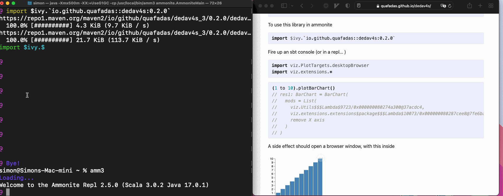
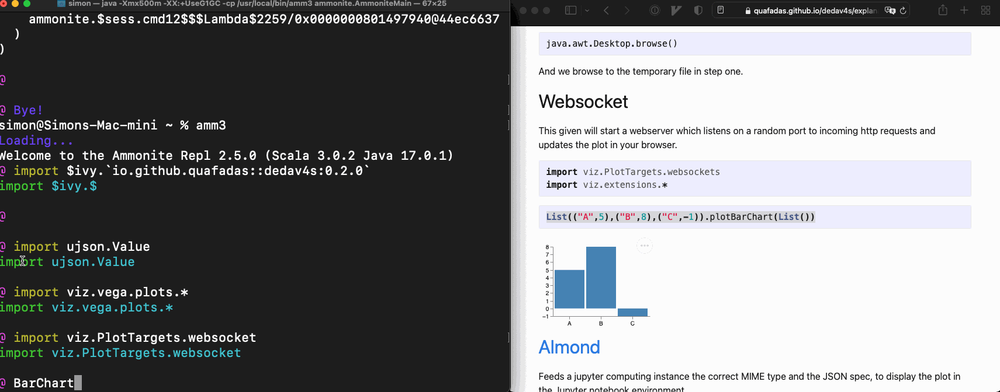
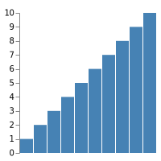

<head>
        <meta charset="utf-8" />
        <!-- Import Vega & Vega-Lite -->
        <script src="https://cdn.jsdelivr.net/npm/vega@5"></script>
        <script src="https://cdn.jsdelivr.net/npm/vega-lite@5"></script>
        <!-- Import vega-embed -->
        <script src="https://cdn.jsdelivr.net/npm/vega-embed@5"></script>
        <style>
		    div.viz {
                width: 25vmin;
                height:25vmin;
                style="position: fixed; left: 0; right: 0; top: 0; bottom: 0"
            }
        </style>
</head>
# Targets
You need to decide where you want to see the chart. For this library, the first class citizen is a browser... 

Every time an object is created which extends the "Spec" trait, it executes the ```newObject.show()``` side effect. That side effect requires context, provided through a [given](https://dotty.epfl.ch/docs/reference/contextual/givens.html) which is in scope. 

Those "given" targets are listed below, all accessible at ```viz.PlotTargets.xxxxx```

Finally, many of these rely on writing temp files. You may specify the location through configuration. Either by having a suitably located "application.conf", or by passing in the environment variable ```DEDAV_OUT_PATH```.

Also, the path of the temporary file is located in the "out" property of the case class, which is of type ```Unit | os.Path```. If the target creates a temporary file, you may "move it around" wherever you wish, using the path as a starting point.

e.g. 
```
sbt -DDEDAV_OUT_PATH=/Users/simon/Pictures   
```

# Scala 3
## Desktop Browser

Will open a new browser window in your desktop based browser, pointing to a temporary file. 


```scala 
import viz.PlotTargets.desktopBrowser
import viz.extensions.*
```

```scala
List(("A",5),("B",8),("C",-1)).plotBarChart(List())
```


<div id="viz_aBt65JYQ" class="viz"></div>

<script type="text/javascript">
const specaBt65JYQ = {
  "$schema": "https://vega.github.io/schema/vega/v5.json",
  "description": "A basic bar chart example, with value labels shown upon mouse hover.",
  "width": 400,
  "height": 200,
  "padding": 5,
  "data": [
    {
      "name": "table",
      "values": [
        {
          "category": "A",
          "amount": 5
        },
        {
          "category": "B",
          "amount": 8
        },
        {
          "category": "C",
          "amount": -1
        }
      ]
    }
  ],
  "signals": [
    {
      "name": "tooltip",
      "value": {
        
      },
      "on": [
        {
          "events": "rect:mouseover",
          "update": "datum"
        },
        {
          "events": "rect:mouseout",
          "update": "{}"
        }
      ]
    }
  ],
  "scales": [
    {
      "name": "xscale",
      "type": "band",
      "domain": {
        "data": "table",
        "field": "category"
      },
      "range": "width",
      "padding": 0.05,
      "round": true
    },
    {
      "name": "yscale",
      "domain": {
        "data": "table",
        "field": "amount"
      },
      "nice": true,
      "range": "height"
    }
  ],
  "axes": [
    {
      "orient": "bottom",
      "scale": "xscale"
    },
    {
      "orient": "left",
      "scale": "yscale"
    }
  ],
  "marks": [
    {
      "type": "rect",
      "from": {
        "data": "table"
      },
      "encode": {
        "enter": {
          "x": {
            "scale": "xscale",
            "field": "category"
          },
          "width": {
            "scale": "xscale",
            "band": 1
          },
          "y": {
            "scale": "yscale",
            "field": "amount"
          },
          "y2": {
            "scale": "yscale",
            "value": 0
          }
        },
        "update": {
          "fill": {
            "value": "steelblue"
          }
        },
        "hover": {
          "fill": {
            "value": "red"
          }
        }
      }
    },
    {
      "type": "text",
      "encode": {
        "enter": {
          "align": {
            "value": "center"
          },
          "baseline": {
            "value": "bottom"
          },
          "fill": {
            "value": "#333"
          }
        },
        "update": {
          "x": {
            "scale": "xscale",
            "signal": "tooltip.category",
            "band": 0.5
          },
          "y": {
            "scale": "yscale",
            "signal": "tooltip.amount",
            "offset": -2
          },
          "text": {
            "signal": "tooltip.amount"
          },
          "fillOpacity": [
            {
              "test": "datum === tooltip",
              "value": 0
            },
            {
              "value": 1
            }
          ]
        }
      }
    }
  ]
}
vegaEmbed('#viz_aBt65JYQ', specaBt65JYQ , {
    renderer: "canvas", // renderer (canvas or svg)
    container: "#viz_aBt65JYQ", // parent DOM container
    hover: true, // enable hover processing
    actions: {
        editor : true
    }
}).then(function(result) {

})
</script>



The library writes a (temporary) file, assuming that

    java.io.File.createTempFile() 

Is available. That temporary file assumes that you have an internet connection, and can resolve 

    <script src="https://cdn.jsdelivr.net/npm/vega-embed@5"></script>
    <script src="https://cdn.jsdelivr.net/npm/vega@5"></script>
    <script src="https://cdn.jsdelivr.net/npm/vega-lite@5"></script>

Finally, we assume the existence of a 

    java.awt.Desktop

Which has a browser available... 

    java.awt.Desktop.browse()

And we browse to the temporary file in step one.

## Websocket

This given will start a webserver which listens on a random port to incoming http requests and updates the plot in your browser.



```scala
import viz.PlotTargets.websockets
import viz.extensions.*
```

```scala
List(("A",5),("B",8),("C",-1)).plotBarChart(List())
```


<div id="viz_Wl41D1mE" class="viz"></div>

<script type="text/javascript">
const specWl41D1mE = {
  "$schema": "https://vega.github.io/schema/vega/v5.json",
  "description": "A basic bar chart example, with value labels shown upon mouse hover.",
  "width": 400,
  "height": 200,
  "padding": 5,
  "data": [
    {
      "name": "table",
      "values": [
        {
          "category": "A",
          "amount": 5
        },
        {
          "category": "B",
          "amount": 8
        },
        {
          "category": "C",
          "amount": -1
        }
      ]
    }
  ],
  "signals": [
    {
      "name": "tooltip",
      "value": {
        
      },
      "on": [
        {
          "events": "rect:mouseover",
          "update": "datum"
        },
        {
          "events": "rect:mouseout",
          "update": "{}"
        }
      ]
    }
  ],
  "scales": [
    {
      "name": "xscale",
      "type": "band",
      "domain": {
        "data": "table",
        "field": "category"
      },
      "range": "width",
      "padding": 0.05,
      "round": true
    },
    {
      "name": "yscale",
      "domain": {
        "data": "table",
        "field": "amount"
      },
      "nice": true,
      "range": "height"
    }
  ],
  "axes": [
    {
      "orient": "bottom",
      "scale": "xscale"
    },
    {
      "orient": "left",
      "scale": "yscale"
    }
  ],
  "marks": [
    {
      "type": "rect",
      "from": {
        "data": "table"
      },
      "encode": {
        "enter": {
          "x": {
            "scale": "xscale",
            "field": "category"
          },
          "width": {
            "scale": "xscale",
            "band": 1
          },
          "y": {
            "scale": "yscale",
            "field": "amount"
          },
          "y2": {
            "scale": "yscale",
            "value": 0
          }
        },
        "update": {
          "fill": {
            "value": "steelblue"
          }
        },
        "hover": {
          "fill": {
            "value": "red"
          }
        }
      }
    },
    {
      "type": "text",
      "encode": {
        "enter": {
          "align": {
            "value": "center"
          },
          "baseline": {
            "value": "bottom"
          },
          "fill": {
            "value": "#333"
          }
        },
        "update": {
          "x": {
            "scale": "xscale",
            "signal": "tooltip.category",
            "band": 0.5
          },
          "y": {
            "scale": "yscale",
            "signal": "tooltip.amount",
            "offset": -2
          },
          "text": {
            "signal": "tooltip.amount"
          },
          "fillOpacity": [
            {
              "test": "datum === tooltip",
              "value": 0
            },
            {
              "value": 1
            }
          ]
        }
      }
    }
  ]
}
vegaEmbed('#viz_Wl41D1mE', specWl41D1mE , {
    renderer: "canvas", // renderer (canvas or svg)
    container: "#viz_Wl41D1mE", // parent DOM container
    hover: true, // enable hover processing
    actions: {
        editor : true
    }
}).then(function(result) {

})
</script>


## [Almond](https://www.almond.sh)


Feeds a jupyter computing instance the correct MIME type and the JSON spec, to display the plot in the Jupyter notebook (or VSCode notebook!) environment.

<strong> GOTCHA : Right now, the current stable release for almond is scala 2.13.4. Dedav works with scala 3, and via backwards compatibility with scala 2.13.6+. So if you want this to work you'll currently need to compile a almond kernel from source...
Also, the extension methods currently use athe ```viz.Utils.fillDiv``` method, which is not compatible with the way Jupyter sizes charts. So don't use those right now. 

Basically there are still a couple of landmnines whilst scala 3 moves through the ecosystem - the intent is to sort this properly in future and there is no fundamental reason this can't work.
</strong>

```scala
import viz.PlotTargets.almond
```
```scala
viz.vega.plots.BarChart(
   List(        
        spec => spec("title") = "Got Viz?", 
        spec => {spec("height") = 200; spec("width") = 200}
    )
)
```

## VSCode 
Use the almond target and a notebook... 

## Do Nothing
```scala
import viz.PlotTargets.doNothing
import viz.extensions.*

List(("A",5),("B",8),("C",-1)).plotBarChart(List())
```
To no ones surprise, does nothing! The implementation simply executes unit ```()```. I regret the CPU cycles. 

## printlnTarget

Formats and prints the final JSON spec to the console. 

```scala
import viz.PlotTargets.printlnTarget
import viz.extensions.*

List(("A",5),("B",8),("C",-1)).plotBarChart(List())
// {
//   "$schema": "https://vega.github.io/schema/vega/v5.json",
//   "description": "A basic bar chart example, with value labels shown upon mouse hover.",
//   "width": 400,
//   "height": 200,
//   "padding": 5,
//   "data": [
//     {
//       "name": "table",
//       "values": [
//         {
//           "category": "A",
//           "amount": 5
//         },
//         {
//           "category": "B",
//           "amount": 8
//         },
//         {
//           "category": "C",
//           "amount": -1
//         }
//       ]
//     }
//   ],
//   "signals": [
//     {
//       "name": "tooltip",
//       "value": {
//         
//       },
//       "on": [
//         {
//           "events": "rect:mouseover",
//           "update": "datum"
//         },
//         {
//           "events": "rect:mouseout",
//           "update": "{}"
//         }
//       ]
//     }
//   ],
//   "scales": [
//     {
//       "name": "xscale",
//       "type": "band",
//       "domain": {
//         "data": "table",
//         "field": "category"
//       },
//       "range": "width",
//       "padding": 0.05,
//       "round": true
//     },
//     {
//       "name": "yscale",
//       "domain": {
//         "data": "table",
//         "field": "amount"
//       },
//       "nice": true,
//       "range": "height"
//     }
//   ],
//   "axes": [
//     {
//       "orient": "bottom",
//       "scale": "xscale"
//     },
//     {
//       "orient": "left",
//       "scale": "yscale"
//     }
//   ],
//   "marks": [
//     {
//       "type": "rect",
//       "from": {
//         "data": "table"
//       },
//       "encode": {
//         "enter": {
//           "x": {
//             "scale": "xscale",
//             "field": "category"
//           },
//           "width": {
//             "scale": "xscale",
//             "band": 1
//           },
//           "y": {
//             "scale": "yscale",
//             "field": "amount"
//           },
//           "y2": {
//             "scale": "yscale",
//             "value": 0
//           }
//         },
//         "update": {
//           "fill": {
//             "value": "steelblue"
//           }
//         },
//         "hover": {
//           "fill": {
//             "value": "red"
//           }
//         }
//       }
//     },
//     {
//       "type": "text",
//       "encode": {
//         "enter": {
//           "align": {
//             "value": "center"
//           },
//           "baseline": {
//             "value": "bottom"
//           },
//           "fill": {
//             "value": "#333"
//           }
//         },
//         "update": {
//           "x": {
//             "scale": "xscale",
//             "signal": "tooltip.category",
//             "band": 0.5
//           },
//           "y": {
//             "scale": "yscale",
//             "signal": "tooltip.amount",
//             "offset": -2
//           },
//           "text": {
//             "signal": "tooltip.amount"
//           },
//           "fillOpacity": [
//             {
//               "test": "datum === tooltip",
//               "value": 0
//             },
//             {
//               "value": 1
//             }
//           ]
//         }
//       }
//     }
//   ]
// }
// res3: BarChart = BarChart(
//   mods = List(
//     viz.extensions.extensions$package$$$Lambda$11177/0x00000008027a9e38@5f0f32da
//   )
// )
```

## Vega CLI outputs
The [vega CLI](https://vega.github.io/vega/usage/#cli) allows you to output pictures to (non interactive) SVG, PNG, and PDF formats. 

This library _does not_ magically set vega cli up for you. It _assumes_ that you have sucessfully done that yourself - i.e. probably you need node.js and have successfully run ```npm install -g vega-cli```... and tested that worked. 

Assuming we're plotting 

```scala
(1 to 10).plotBarChart()
```

### PNG
```scala
import viz.PlotTargets.pdf
```


### PDF
```scala
$import viz.PlotTargets.pdf
````
Markdown can't display this... but it works I promise.
### SVG
```scala
import viz.PlotTargets.svg
````


# Scala 2
There isn't really "support" for scala 2 per se, however... if you have scala 2.13.7, then the library may be used via the forward compatibility mechanism, so for almond / ammonite, or the equivalent SBT statment.

Everything will work as above, noting the below. 

```
scala.util.Properties.versionString
```
Will need to say 2.13.7 or higher. To import

```scala 
import $ivy.`io.github.quafadas:dedav4s_3:0.0.9`
```
You'll need the tasty reader scalac flag set true. 

```scala
interp.configureCompiler(_.settings.YtastyReader.value = true)
```

Finally, if you wish to use this in an almond or vscode notebook environment with scala 2, you'll need to interact with the kernel directly. 

```scala
import viz.PlotTarget.doNothing

val chart = BarChart()

kernel.publish.display(
  almond.interpreter.api.DisplayData(
    data = Map(      
      "application/vnd.vega.v5+json" -> chart.spec
    )
  )  
)
```


