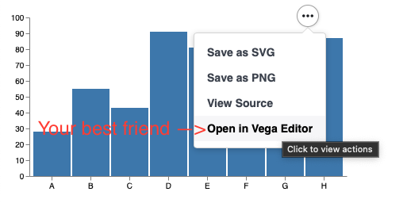

<head>
        <meta charset="utf-8" />
        <!-- Import Vega & Vega-Lite -->
        <script src="https://cdn.jsdelivr.net/npm/vega@5"></script>
        <script src="https://cdn.jsdelivr.net/npm/vega-lite@5"></script>
        <!-- Import vega-embed -->
        <script src="https://cdn.jsdelivr.net/npm/vega-embed@5"></script>
        <style>
		    div.viz {
                width: 25vmin;
                height:25vmin;
                style="position: fixed; left: 0; right: 0; top: 0; bottom: 0"
            }
        </style>
</head>

The library exposes the [vega examples](https://vega.github.io/vega/examples/) and [vega lite examples](https://vega.github.io/vega-lite/examples/) convieniently as case classes. The class names correspond to the title of the charts (with some special characters removed).

## Suggested Workflow
1. Identify a plot which looks similar to your desired visualisation
2. Customise it, by modifiying the JSON spec to be your desired visualisation

As always... lean into vega;



## Some Concepts
Each "plot" is a case class which accepts a list of "modifiers". Each case class has the signature accepting a single argument of type; 

```scala
Seq[ujson.Value => Unit] 
```
i.e. a list of functions which modifiy a ```ujson.Value```
This signature appears often enough that it is aliased as;

```scala
type JsonMod = Seq[ujson.Value => Unit]
```

Upon creation, each of these functions is applied to a "base spec". To start with, a base spec will be an example from the vega website). The signature of ```viz.vega.plots.SimpleBarChart()``` is
```scala 
case class BarChart(override val mods : JsonMod=List())(using PlotTarget) extends FromUrl(SpecUrl.BarChart)
```
The constiuents of this definition are;
- mods change the spec (to make it look the way you want - for example adding your own data)
- PlotTarget is a side effect which is run when the case class is created. Often will display the plot in a browser.
- The final part tells this case class, where to obtain a "base specification". In this case, https://vega.github.io/vega/examples/bar-chart.vg.json

What that means, is that to add a title, we need to [read the vega docs](https://vega.github.io/vega/docs/title/). To skip some steps, try...

```scala
SimpleBarChartLite(List(spec => spec("title") = "Got Viz?"))
```

We'll revisit this in more detail below. Crucially, to know _where_ to add stuff to the spec, you're going to need the vega documentation. 

[Vega documentation](https://vega.github.io/vega/docs/)

[Vega Lite documentation](https://vega.github.io/vega-lite/docs/)

Finally, a small number of "helpers" appear often enough that they are honoured with an implementation in the library; 

```scala
SunburstDrag(List(viz.Utils.fillDiv, viz.Utils.fixDefaultDataUrl))
```

## Levels of abstraction
You need a [plot target](plotTargets.md) in place, and then we're ready to plot some data. The idea of the library is to wrap vega by simply treating a chart spec as a JSON object.  

We can easily manipulate JSON objects using [ujson](https://www.lihaoyi.com/post/uJsonfastflexibleandintuitiveJSONforScala.html). 

I work with this library in 4 ways
1. Pipe "raw" data into a vega example
1. Record a list of modifiers which were useful modifications to an example
1. Spec has been modified enough that a list of modifiers is confusing. Extend the WithBaseSpec class directly via a file or resource (see "Custom.scala"). Then pipe data into it.
1. In prod... don't use this library anymore - probably you have a webserver which means you already have javascript. Use vega directly, Keep the spec under version control and use vega data loading capabilities to talk to the API providing data. 


## "Raw" Data

The idea here, is that "raw datatypes" have some unambiguous visualisation which is relatively common to want to plot. Pie charts, bar charts and the like, which are always going to look very similar to the examples on the vega website, and come from a simple datastructure. We want to be able to plot these as quickly as possible. 

```scala mdoc
import viz.PlotTargets.desktopBrowser
import viz.extensions.*
```

```scala mdoc:invisible:reset
import viz.PlotTargets.doNothing
import viz.extensions.*
```

### Labelled bar chart
```scala
List(("A", 4),("B", 6),("C", -1)).plotBarChart(List())
```
```scala mdoc:vegaplot
List(("A", 4),("B", 6),("C", -1)).plotBarChart(List())
```

### Bar chart
```scala
val secondChart = (1 to 5).plotBarChart()
```
```scala mdoc:vegaplot
val secondChart = (1 to 5).plotBarChart()
```

### Word cloud
```scala
List(
   "how much wood would a wood chuck chuck if a wood chuck could chuck wood", 
   "a wood chuck would chuck as much wood as a wood chuck could chuck if a wood chuck could chuck wood"
).plotWordcloud()
```
```scala mdoc:vegaplot
List(
   "how much wood would a wood chuck chuck if a wood chuck could chuck wood", 
   "a wood chuck would chuck as much wood as a wood chuck could chuck if a wood chuck could chuck wood"
).plotWordcloud()
```
### Line Chart
```scala
List(1,5,3,15,7,8).plotLineChart()
```
```scala mdoc:vegaplot
List(1,5,3,15,7,8).plotLineChart()
```
### Dot Plot
```scala
List(1,11,1,2,3,4,4,4,4,4,5,6,8,8,9,8).plotDotPlot()
```
```scala mdoc:vegaplot
List(1,11,1,2,3,4,4,4,4,4,5,6,8,8,9,8).plotDotPlot()
```
### Scatter Plot
```scala
List((1.0,2.0),(3.0,4.0),(0.5 , 5.0),(3.14159, 1.0)).plotScatter()
```
```scala mdoc:vegaplot
List((1.0,2.0),(3.0,4.0),(0.5 , 5.0),(3.14159, 1.0)).plotScatter()
```
### Regression
```scala
List((1.0,2.0),(3.0,4.0),(0.5 , 5.0),(3.14159, 1.0)).plotRegression()
```
```scala mdoc:vegaplot
List((1.0,2.0),(3.0,4.0),(0.5 , 5.0),(3.14159, 1.0)).plotRegression()
```

## "Spec Customisation"
Is one level of abstraction deeper. 

The core promise of the library, is that it wraps Vega. It goes one further step, by making the "examples" on the vega website, easy to plot, and then customise.

```scala mdoc
viz.vega.plots.LineChartLite(
    List(
        viz.Utils.fixDefaultDataUrl
    )
)
```
```scala mdoc:vegaplot
viz.vega.plots.LineChartLite(List(viz.Utils.fixDefaultDataUrl))
```
As we've changed the home of the chart (which no longer is on the vega lite examples homepage), we also need to adapt it's data url to point to the right place, else data loading will fail. It's not a bad excercise to allow that failure. 


This is our hint on how we're going to manage minor modifications to plots. 

Here, we have the line chart example from vega lite. ```viz.vega.plots.xxx``` contains _all_ the examples on the vega, and vega-lite websites. vega-lite charts have "lite" appended.

Someone was apparently crazy enough to implement pacman in vega. As "proof" that we really did _all_ the examples, and for your gaming pleasure.

```scala mdoc
viz.vega.plots.Pacman()
```
```scala mdoc:vegaplot
viz.vega.plots.Pacman()
```
More seriously though, this library is targeted at "work". 

We need a way to customise charts, which we've hinted at above, by providing a list of "modifiers". A very common customisation, is to want to display your own data (!), from the JVM / ammonite / scala runtime, in the chart. Conceptually this is no different from all the other modification we will make - just change the JSON object.

### Line chart

Our aim is to plot a line chart with our own data.

```scala mdoc
import java.time.LocalDate
case class TimeSeries(series: Seq[(LocalDate, Double)])
val ts = TimeSeries(Seq((LocalDate.now(), 1.5), (LocalDate.of(2021,1,1), 0.2), (LocalDate.of(2021,6,1), 20)))
```
We'll need a ```Seq[ujson.Value => Unit]```, and the vega-lite example line chart. 

#### Adding a title
To start simple, let's add a title modifier. 

I'm writing out the types here in the hopes of being helpful. It looks harder than it is... After you've done it twice it gets easy. 
```scala mdoc
import viz.vega.plots.LineChartLite
import viz.Utils
val addTitle : ujson.Value => Unit = (spec:ujson.Value) => spec("title") = "A Timeseries"
LineChartLite(
    Seq(
        addTitle, 
        Utils.fixDefaultDataUrl 
    )
)
```

```scala mdoc:vegaplot
LineChartLite(Seq(addTitle, Utils.fixDefaultDataUrl ))
```
But there are a couple of things which are messy about our modification;
1. We've hardcoded the title
2. the anonymous function display is very anonymous, no idea what that lambda did. 

Let's have another go. With a little more ceremony, we have something that looks reasonable afterwards.

#### Better title modifier

```scala mdoc
def addTitleB(in:String): ujson.Value => Unit = new((ujson.Value => Unit)) {
    override def toString = s"set title to be $in"
    def apply(spec: ujson.Value) = spec("title") = in
 }
LineChartLite(Seq(addTitleB("Much better"), Utils.fixDefaultDataUrl ))
```

```scala mdoc:vegaplot
LineChartLite(Seq(addTitleB("Much better"), Utils.fixDefaultDataUrl ))
```
At this point, i think it's clear how we're going to deal with piping in the data - the same way as we injected a title

#### Piping in the data

```scala mdoc
def addData(in: TimeSeries) = new (ujson.Value => Unit) {
    override def toString = "pipe in data" 
    def apply(spec: ujson.Value) =    
        val data = in.series.sortBy(_._1).map(point => ujson.Obj("date" -> point._1.toString(), "price" -> point._2))
        spec("data") = ujson.Obj("values" -> data)
        spec.obj.remove("transform")
}
LineChartLite(Seq(addTitleB("Now with data"), addData(ts) ))
```

```scala mdoc:vegaplot
LineChartLite(Seq(addTitleB("Now with data!"), addData(ts) ))
```

Generally, I find that the best "workflow", is to pump the data into the spec and plot it. It usually shows up blank. Open it up in the vega editor and fix it. It's then easy to backport the modification into scala. 

# Conclusion
There's nothing that says 

1. Your plot can't be a method defined on the Timeseries class itself. That's an obvious and trivial next step.
1. You have to own the data structure - have a look at the example on the homepage. That works through an extension method defined on ```Numeric[Iterable]```

Which means you can "interface" plotting on datatypes of interest to you. I found this to be a powerful concept

