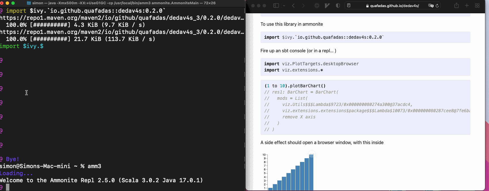

# Dedav4s

Declarative data visualization for scala - a scala plotting concept. 

It is written exclusively in scala 3. There are currently no plans to backport to scala 2.

## Elevator Pitch

# Background Information
This is a thin shim around [vega](https://vega.github.io/vega/) and [vega lite](https://vega.github.io/vega-lite/). It's aims are:

1. To make exploratory analysis in a repl (or in a notebook) as easy as possible.
2. To make the barrier to publication (via scala js) as low as possible.
3. To wrap vega / lite in such a manner that charting is robust... with the dream being compile errors for charting

It pays to have an understanding (or at least some idea of what bega / lite are), both Vega & Vega-Lite. It may be worth taking a few minutes to orient yourself with this [talk/demo](https://www.youtube.com/watch?v=9uaHRWj04D4) from the creators at the Interactive Data Lab (IDL) at University of Washington.

If you are interested in plotting in general, I think that you will not regret learning a declarative paradigm.

# The important links
[Vega documentation](https://vega.github.io/vega/docs/)

[Vega Lite documentation](https://vega.github.io/vega-lite/docs/)

# Project status
It's more or less achieved my goals on the JVM. On the JVM it currently contains targets for:

1. repl
2. notebooks
3. websockets
4. gitpod
5. Svg, pdf and png files

Many of the targets above rely on writing out temporary files - those are accessible in the case class you get back. You can copy them around and automate your charting workflow.

On Scala JS

This is current not solved to my satisfaction... but is certainly possible.

# High Level Design

Vega / Lite work by interpreting a JSON object, and drawing that spec on the screen. It's at first daunting... but absurdly effective if you can get your head round it.

By far the easiest way to get started is to start from a plot the looks close to what you want, and evolve it. Therefore, this project contains the http addresses of the _entire_ suite of vega examples. The aliases are pretty obvious and discoverable through tab completion. 

The entire example suite is then an http request away. It's then up to you to pump in your data, mutate the look and feel or create your own.

Vega also publish a Schema. That schema has been interpreted (via app quicktype) into a set of scala types which represent the entire opportunity set of vega plots. It is however, ferociously complex.

There are three basic approaches enabled.

1. A strongly typed DSL
2. Mutable
3. A mix

I personally favour "A mix". Each "approach" is documented by example.