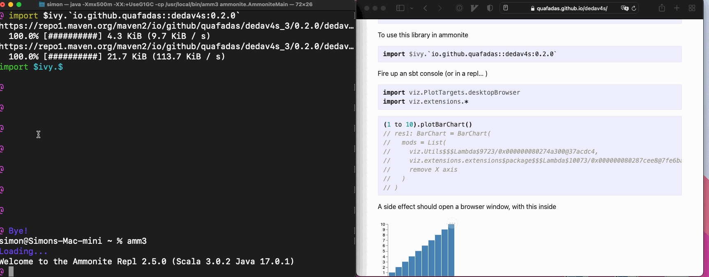

# Plot Targets

I have wanted to see my plots in many places. I haven't yet found one, that vega won't do.

## Desktop Browser
Will open a new browser window in your desktop based browser, pointing to a temporary file.




```scala mdoc:invisible
import viz.PlotTargets.doNothing
import viz.vegaFlavour
import viz.extensions.*
```
```scala
import viz.PlotTargets.desktopBrowser
import viz.extensions.*
```
```scala
val out = List(("A",5),("B",8),("C",-1)).plotBarChart(List())
out.toString()
```
```scala mdoc:vegaspec:desktopBrowser
val out = List(("A",5),("B",8),("C",-1)).plotBarChart(List())
out.toString()
```

```scala mdoc:js:invisible
viz.doc.showJsDocs("desktopBrowser", node, 0 )
```
### How desktop browser works
The library writes a (temporary) file, assuming that

    java.io.File.createTempFile()

Is available. That temporary file assumes that you have an internet connection, and can resolve

    <script src="https://cdn.jsdelivr.net/npm/vega-embed@5"></script>
    <script src="https://cdn.jsdelivr.net/npm/vega@5"></script>
    <script src="https://cdn.jsdelivr.net/npm/vega-lite@5"></script>

Finally, we assume the existence of a

    java.awt.Desktop

Which has a browser available...

    java.awt.Desktop.browse()

And we browse to the temporary file created in step one. On some linux distributions, this may not work. Consider using the websocket target instead.

## Websocket

For this to work, it's far easier, to start the server, on a seperate process. You can do this using coursier in one line.

```shell
cs launch io.github.quafadas:dedav4s_3:0.9.0 -M viz.websockets.serve -- 8085
```

This should start a server on port 8085. Check by visiting http://localhost:8085 in your browser. It should say "connected and waiting".

You can then use the `publishToPort` plot target, which will send the spec, to the server listening on that port.


```scala
import viz.PlotTargets.publishToPort
import viz.extensions.*

given port: Int = 8085
List(("A",5),("B",8),("C",-1)).plotBarChart(List())
```

### Multiple plots
I often want to see multiple plots. Navigate to
`http://localhost:8085/view/hi`, and you'll see "connected and waiting" again.
`http://localhost:8085/view/bob`, and you'll see "connected and waiting" again.

Now, you'll need to update the desription of the chart, to match the trailing path of the url. e.g.

```scala
given port: Int = 8085
List(("A",0),("B",-8),("C",20)).plotBarChart(List(spec => spec("description") = "hi"))
List(("A",5),("B",8),("C",-1)).plotBarChart(List(spec => spec("description") = "bob"))
```

And both browser tabs will now update with their respective plots.

## [Almond](https://www.almond.sh)


Feeds a jupyter computing instance the correct MIME type and the JSON spec, to display the plot in the Jupyter notebook (or VSCode notebook!) environment.

```scala
import viz.PlotTargets.almond
```
```scala
viz.vega.plots.BarChart(
   List(
        spec => spec("title") = "Got Viz?",
        spec => {spec("height") = 200; spec("width") = 200}
    )
)
```

## VSCode
Use the almond target and a `.ipynb`...

## Gitpod

Gitpod support is kind of brittle and needs a little config. By default, dedav will attempt to contact port 48485 of a webserver it starts in the pod. It will detect the pod address through the gitpod [environment variables](https://www.gitpod.io/docs/environment-variables).

You may change the port number, by setting the environment variable ```DEDAV_POD_PORT```. If it is not set, it's default port is 48485.

The port number, you will need to set in the configuration of your gitpod project. In your .gitpod.yml

```
ports:
  - port: 48485
    onOpen: open-browser
    visibility: public
```
48485 is if you do not require a custom port. In your repl, try...

```scala
import viz.PlotTargets.gitpod
import viz.vegaFlavour
import viz.extensions.RawIterables.*

List(("A",5),("B",8),("C",-1)).plotBarChart(List())
List(("A",5),("B",8),("C",-1)).plotBarChart(List())
```

The duplicates command is deliberate. The first request will be ignored - it starts the webserver behind the scenes. Unfortunately, I can't find a way to wait for that process to finish, and then send the request - gitpod appears to wait to open up the ports, until the command has finished executing. I am outsmarted...

The second request however... should work...


## Do Nothing
```scala
import viz.PlotTargets.doNothing
import viz.extensions.RawIterables.*

List(("A",5),("B",8),("C",-1)).plotBarChart(List())
```
To no ones surprise, does nothing! The implementation simply executes unit ```()```. I regret the CPU cycles :-).

Importantly, this is default behaviour - important when we reach scala JS.

## printlnTarget

Formats and prints the final JSON spec to the console.

```scala mdoc:reset
import viz.PlotTargets.printlnTarget
import viz.vegaFlavour
import viz.extensions.*

List(("A",5),("B",8),("C",-1)).plotBarChart(List())
```

## Vega CLI outputs
The [vega CLI](https://vega.github.io/vega/usage/#cli) allows you to output pictures to (non interactive) SVG, PNG, and PDF formats.

This library _does not_ magically set vega cli up for you. It _assumes_ that you have sucessfully done that yourself - i.e. probably you need node.js and have successfully run ```npm install -g vega-cli```... and tested that worked.

Assuming we're plotting

```scala
(1 to 10).plotBarChart()
```

### PNG
```scala
import viz.PlotTargets.pdf
```


### PDF
```scala
$import viz.PlotTargets.pdf
````
Markdown can't display this... but it works I promise.

### SVG
```scala
import viz.PlotTargets.svg
````


### How it works
For this library, the first class citizen is a browser...

Every time an object is created which extends the "Spec" trait, it executes the ```newObject.show()``` side effect. That side effect requires context, provided through a [given](https://dotty.epfl.ch/docs/reference/contextual/givens.html) PlotTarget which is in scope.

Those "given" targets, described below, are accessible at ```viz.PlotTargets.xxxxx```


Many of these rely on writing temp files, and a ```java.awt.Desktop.browse()```, and an internet connection. If your environment does not have those capabilities, then you'll need to look elsewhere or take an advanced approach.


The path of the temporary file is located in the "out" property of the case class, which is of type ```Unit | os.Path```. If the target creates a temporary file, you may "move it around" wherever you wish, using the path as a starting point.